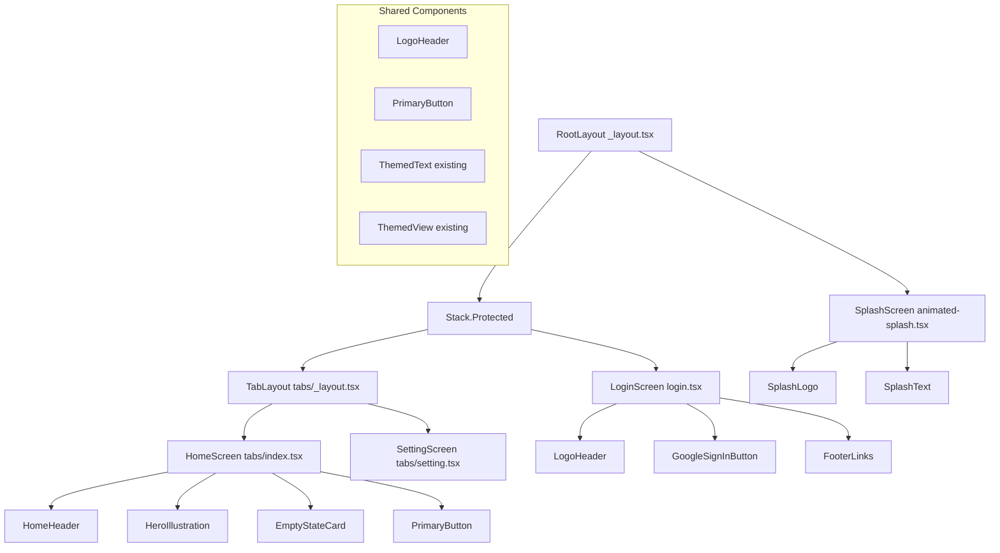
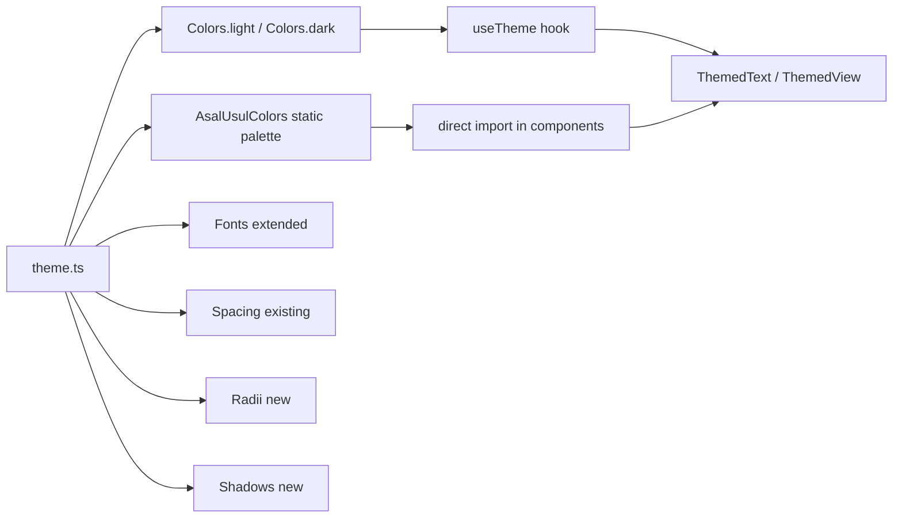
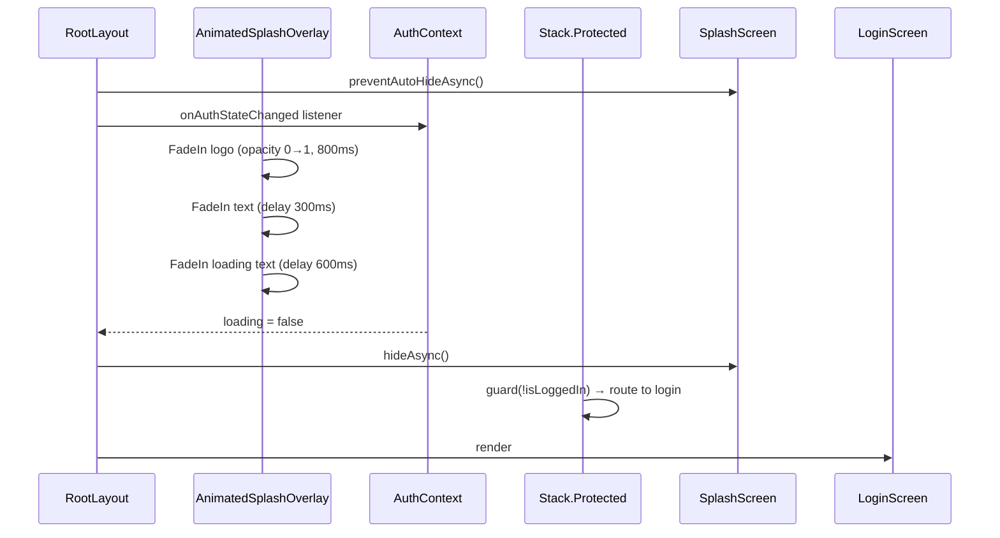
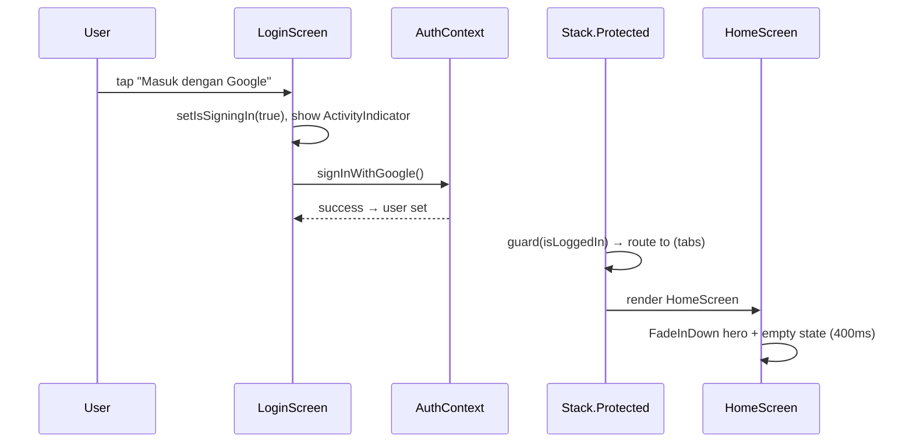

# Design Document: AsalUsul UI Foundation

## Overview

This feature replaces the generic boilerplate UI of the AsalUsul app with a premium, heritage-inspired Indonesian genealogy experience. The redesign covers three screens — Splash, Login, and Home (empty state) — plus an extended theme system, all built with StyleSheet + theme constants (no NativeWind), Reanimated 4.x animations, and the existing component primitives (`ThemedText`, `ThemedView`, `useTheme`, `useAuth`).

The design philosophy is **calm minimalism with cultural warmth**: soft beige backgrounds, dark forest-green accents, generous whitespace, rounded surfaces, and subtle shadows that evoke the feel of a premium heritage product rather than a generic mobile app.

The implementation is strictly additive — `auth-context.tsx`, `app-tabs.tsx`, and the Expo Router file structure remain untouched. All new UI components are modular, typed, and reusable.

---

## Architecture

### Screen & Component Hierarchy



### Theme Extension Strategy



---

## Sequence Diagrams

### Splash → Login Flow



### Login → Home Flow



---

## Theme System

### Extended `theme.ts` — AsalUsul Palette

The existing `Colors` object is extended with an `asalUsul` namespace for the brand palette. These are **static** values (not light/dark variants) used directly in screen-specific StyleSheets.

```typescript
// constants/theme.ts additions

export const AsalUsulColors = {
  // Backgrounds
  backgroundWarm:    '#F5F0E8',   // primary screen background (warm beige)
  backgroundCard:    '#FDFAF4',   // card / elevated surface
  backgroundOverlay: '#EDE8DC',   // subtle divider / pressed state

  // Brand
  primary:           '#1B4332',   // dark forest green — CTAs, icons, accents
  primaryLight:      '#2D6A4F',   // hover / pressed state for primary
  primaryMuted:      '#52796F',   // secondary text on dark surfaces

  // Text
  textHeading:       '#1A1A1A',   // near-black for headings
  textBody:          '#3D3D3D',   // body copy
  textMuted:         '#8A8070',   // captions, placeholders, footer text
  textOnPrimary:     '#FFFFFF',   // text on dark green buttons

  // Decorative
  goldAccent:        '#C9A84C',   // optional heritage gold for ornamental use
  borderSubtle:      '#E0D9CC',   // card borders, dividers
} as const;

export type AsalUsulColor = keyof typeof AsalUsulColors;

// New layout tokens
export const Radii = {
  sm:   8,
  md:   16,
  lg:   24,
  pill: 999,
} as const;

export const Shadows = {
  card: {
    shadowColor:   '#1B4332',
    shadowOffset:  { width: 0, height: 4 },
    shadowOpacity: 0.10,
    shadowRadius:  12,
    elevation:     6,
  },
  button: {
    shadowColor:   '#1B4332',
    shadowOffset:  { width: 0, height: 6 },
    shadowOpacity: 0.25,
    shadowRadius:  16,
    elevation:     8,
  },
} as const;
```

### Typography Scale

The existing `ThemedText` `type` variants are reused. Screen-specific overrides are applied via the `style` prop:

| Role | ThemedText type | Override fontSize | Weight |
|---|---|---|---|
| App name (splash/login) | `title` | 36 | 700 |
| Tagline | `default` | 16 | 400 |
| Section heading | `subtitle` | 24 | 600 |
| Body copy | `default` | 15 | 400 |
| Caption / footer | `small` | 12 | 400 |
| Button label | `smallBold` | 15 | 700 |

---

## Components and Interfaces

### 1. `SplashScreen` — `components/splash-screen.tsx`

Replaces `AnimatedSplashOverlay` + `AnimatedIcon` for the AsalUsul brand. Rendered inside `_layout.tsx` in place of the current `<AnimatedSplashOverlay />`.

**Purpose**: Full-screen branded splash with logo, app name, tagline, and loading indicator. Fades out when auth loading completes.

**Interface**:
```typescript
interface SplashScreenProps {
  /** Called after the exit animation completes so the parent can unmount. */
  onAnimationComplete: () => void;
}
```

**Responsibilities**:
- Render full-screen warm-beige background (`AsalUsulColors.backgroundWarm`)
- Animate logo in with `FadeIn` (Reanimated entering animation, 800ms)
- Animate app name + tagline in with `FadeInDown` (delay 300ms, 600ms duration)
- Animate loading text in with `FadeIn` (delay 600ms)
- On `onAnimationComplete` trigger: run `FadeOut` exit animation then call prop

**Animation spec**:
```
Logo:        opacity 0→1, translateY -10→0, duration 800ms, easing ease-out
App name:    opacity 0→1, translateY 12→0, duration 600ms, delay 300ms
Tagline:     opacity 0→1, duration 500ms, delay 450ms
Loading text: opacity 0→0.6, duration 400ms, delay 600ms
Exit overlay: opacity 1→0, duration 400ms (triggered by parent)
```

---

### 2. `LogoHeader` — `components/logo-header.tsx`

Shared between `SplashScreen` and `LoginScreen`.

**Purpose**: Centered logo image + app name + optional tagline.

**Interface**:
```typescript
interface LogoHeaderProps {
  /** Show the tagline below the app name. Default: false */
  showTagline?: boolean;
  /** Override logo container size. Default: 96 */
  logoSize?: number;
  /** Additional style for the outer container */
  style?: StyleProp<ViewStyle>;
}
```

**Responsibilities**:
- Render `expo-image` `<Image>` with `source={require('@/assets/images/asal-usul-logo.png')}`, `contentFit="contain"`
- Render app name "AsalUsul" using `ThemedText type="title"` with `AsalUsulColors.textHeading`
- Optionally render tagline "Jejak Keluarga dalam Satu Pohon" using `ThemedText type="small"` with `AsalUsulColors.textMuted`

---

### 3. `GoogleSignInButton` — `components/google-sign-in-button.tsx`

**Purpose**: Branded Google Sign-In pill button with icon, label, loading state, and shadow.

**Interface**:
```typescript
interface GoogleSignInButtonProps {
  onPress: () => void;
  isLoading?: boolean;
  disabled?: boolean;
  /** Override label. Default: "Masuk dengan Google" */
  label?: string;
}
```

**Responsibilities**:
- Dark green pill shape (`backgroundColor: AsalUsulColors.primary`, `borderRadius: Radii.pill`)
- Google icon on the left (`@expo/vector-icons` `AntDesign` `"google"`, size 20, color white)
- Label text using `ThemedText type="smallBold"` color white
- `ActivityIndicator` replaces icon+label when `isLoading=true`
- Apply `Shadows.button` for depth
- Press state: `opacity 0.85` via `Pressable` `style` callback
- `accessibilityRole="button"`, `accessibilityLabel` from `label` prop

---

### 4. `HeroIllustration` — `components/hero-illustration.tsx`

**Purpose**: Placeholder hero area for the Home screen empty state. Designed to be swapped for a real illustration asset later.

**Interface**:
```typescript
interface HeroIllustrationProps {
  /** Width of the illustration container. Default: 240 */
  size?: number;
  style?: StyleProp<ViewStyle>;
}
```

**Responsibilities**:
- Render a rounded rectangle placeholder (`AsalUsulColors.backgroundCard`, `borderRadius: Radii.lg`, `borderWidth: 1`, `borderColor: AsalUsulColors.borderSubtle`)
- Inside: a tree icon (`Ionicons "git-network-outline"`, size 64, color `AsalUsulColors.primaryMuted`) centered
- Aspect ratio 4:3

---

### 5. `PrimaryButton` — `components/primary-button.tsx`

**Purpose**: Reusable full-width CTA button in the AsalUsul brand style.

**Interface**:
```typescript
interface PrimaryButtonProps {
  label: string;
  onPress: () => void;
  isLoading?: boolean;
  disabled?: boolean;
  /** 'filled' = dark green bg, 'outline' = transparent bg with green border */
  variant?: 'filled' | 'outline';
  style?: StyleProp<ViewStyle>;
}
```

**Responsibilities**:
- `filled`: `backgroundColor: AsalUsulColors.primary`, white label, `Shadows.button`
- `outline`: transparent bg, `borderColor: AsalUsulColors.primary`, green label, no shadow
- `borderRadius: Radii.pill`, `paddingVertical: Spacing.three`, `minHeight: 52`
- `ActivityIndicator` when `isLoading=true`
- Press opacity feedback via `Pressable`

---

### 6. `HomeHeader` — `components/home-header.tsx`

**Purpose**: Top navigation bar for the Home screen showing app name and optional action icon.

**Interface**:
```typescript
interface HomeHeaderProps {
  /** Right-side action icon name from Ionicons */
  actionIcon?: keyof typeof Ionicons.glyphMap;
  onActionPress?: () => void;
}
```

**Responsibilities**:
- Render "AsalUsul" wordmark left-aligned using `ThemedText type="subtitle"` with `AsalUsulColors.primary`
- Optional right-side `Ionicons` icon button
- `SafeAreaView` top inset handled by parent screen

---

## Data Models

### Theme Token Types

```typescript
// Exported from constants/theme.ts

export type AsalUsulColor = keyof typeof AsalUsulColors;

export type RadiusToken = keyof typeof Radii;

export type ShadowToken = keyof typeof Shadows;
```

### Screen State Models

```typescript
// LoginScreen local state
interface LoginScreenState {
  isSigningIn: boolean;
  errorMessage: string | null;
}

// HomeScreen — no local state beyond auth user (from useAuth)
// Empty state is derived: user is authenticated but has no family trees
// (family tree data model is out of scope for this feature)
interface HomeScreenState {
  // Derived from useAuth
  displayName: string | null;
}
```

---

## Algorithmic Pseudocode

### Splash Animation Sequence

```pascal
PROCEDURE runSplashAnimation(onComplete)
  INPUT: onComplete callback
  OUTPUT: side-effect — animated UI, then calls onComplete

  SEQUENCE
    // Phase 1: Enter animations (Reanimated entering props)
    logoView.entering    ← FadeInDown.duration(800).springify()
    appNameView.entering ← FadeInDown.duration(600).delay(300)
    taglineView.entering ← FadeIn.duration(500).delay(450)
    loadingView.entering ← FadeIn.duration(400).delay(600)

    // Phase 2: Wait for auth loading to resolve (parent signals via prop)
    WAIT UNTIL onAnimationComplete prop is triggered

    // Phase 3: Exit animation
    overlayOpacity ← withTiming(0, { duration: 400 })
    AFTER 400ms: runOnJS(onComplete)()
  END SEQUENCE
END PROCEDURE
```

**Preconditions**:
- `react-native-reanimated` is installed and configured in `babel.config.js`
- `Animated.View` wraps each animated element
- `entering` prop accepts Reanimated `BaseAnimationBuilder` instances

**Postconditions**:
- All elements are visible after enter phase
- Overlay is fully transparent after exit phase
- `onComplete` is called exactly once

**Loop Invariants**: N/A (sequential, no loops)

---

### Theme Color Resolution

```pascal
FUNCTION resolveColor(colorKey, scheme)
  INPUT: colorKey of type AsalUsulColor | ThemeColor, scheme of type 'light' | 'dark'
  OUTPUT: hexColor of type string

  BEGIN
    IF colorKey IN AsalUsulColors THEN
      RETURN AsalUsulColors[colorKey]   // static, not scheme-dependent
    ELSE IF colorKey IN Colors[scheme] THEN
      RETURN Colors[scheme][colorKey]   // scheme-aware
    ELSE
      THROW Error("Unknown color key: " + colorKey)
    END IF
  END
END FUNCTION
```

**Preconditions**: `colorKey` is a valid key in either `AsalUsulColors` or `Colors.light`
**Postconditions**: Returns a valid CSS hex color string

---

### GoogleSignInButton Press Handler

```pascal
PROCEDURE handleGoogleSignIn(signInWithGoogle, setIsSigningIn, setErrorMessage, timeoutRef)
  INPUT: auth context functions, local state setters, timeout ref
  OUTPUT: side-effect — triggers Google OAuth flow

  BEGIN
    IF isSigningIn = true THEN RETURN   // prevent double-tap

    setIsSigningIn(true)
    setErrorMessage(null)

    timeoutRef.current ← setTimeout(
      LAMBDA: setIsSigningIn(false); setErrorMessage("Waktu habis. Coba lagi."),
      30000
    )

    TRY
      AWAIT signInWithGoogle()
      // Navigation handled automatically by Stack.Protected in _layout.tsx
    CATCH error
      message ← error.message OR "Masuk gagal. Coba lagi."
      setErrorMessage(message)
    FINALLY
      clearTimeout(timeoutRef.current)
      setIsSigningIn(false)
    END TRY
  END
END PROCEDURE
```

**Preconditions**: `signInWithGoogle` is provided by `useAuth()` within `AuthProvider`
**Postconditions**: `isSigningIn` is always reset to `false` in the `finally` block

---

## Key Functions with Formal Specifications

### `SplashScreen` component

```typescript
function SplashScreen({ onAnimationComplete }: SplashScreenProps): JSX.Element
```

**Preconditions**:
- `onAnimationComplete` is a stable callback reference (memoized by parent)
- `assets/images/asal-usul-logo.png` exists at the declared path

**Postconditions**:
- Renders a full-screen `View` with `AsalUsulColors.backgroundWarm` background
- Logo, app name, tagline, and loading text are each wrapped in `Animated.View` with `entering` props
- Component unmounts (or becomes invisible) after `onAnimationComplete` is called

---

### `LogoHeader` component

```typescript
function LogoHeader({ showTagline, logoSize, style }: LogoHeaderProps): JSX.Element
```

**Preconditions**:
- `logoSize` is a positive number if provided
- Logo asset exists

**Postconditions**:
- Renders `Image` with `contentFit="contain"` and explicit `width`/`height` equal to `logoSize`
- App name is always rendered
- Tagline is rendered if and only if `showTagline === true`

---

### `GoogleSignInButton` component

```typescript
function GoogleSignInButton({ onPress, isLoading, disabled, label }: GoogleSignInButtonProps): JSX.Element
```

**Preconditions**:
- `onPress` is a valid function reference

**Postconditions**:
- When `isLoading=true`: renders `ActivityIndicator`, `onPress` is not invokable
- When `isLoading=false`: renders Google icon + label text
- `accessibilityState.busy` mirrors `isLoading`
- `accessibilityState.disabled` mirrors `disabled || isLoading`

---

### `PrimaryButton` component

```typescript
function PrimaryButton({ label, onPress, isLoading, disabled, variant, style }: PrimaryButtonProps): JSX.Element
```

**Preconditions**:
- `label` is a non-empty string
- `variant` defaults to `'filled'` if not provided

**Postconditions**:
- `filled` variant: dark green background, white text, shadow applied
- `outline` variant: transparent background, green border, green text, no shadow
- `disabled || isLoading` → `opacity: 0.5`, `onPress` not invokable

---

## Screen Layouts

### Splash Screen Layout

```
┌─────────────────────────────────┐
│                                 │
│                                 │
│         [Logo 96×96]            │  ← FadeInDown, 800ms
│                                 │
│           AsalUsul              │  ← FadeInDown, 600ms, delay 300ms
│   Jejak Keluarga dalam Satu     │  ← FadeIn, 500ms, delay 450ms
│            Pohon                │
│                                 │
│                                 │
│                                 │
│       Memuat...                 │  ← FadeIn, 400ms, delay 600ms, opacity 0.6
└─────────────────────────────────┘
Background: #F5F0E8
```

### Login Screen Layout

```
┌─────────────────────────────────┐
│  SafeAreaView (top inset)       │
│                                 │
│         [Logo 80×80]            │
│           AsalUsul              │
│   Jejak Keluarga dalam Satu     │
│            Pohon                │
│                                 │
│  ┌───────────────────────────┐  │
│  │  Selamat Datang           │  │  ← subtitle
│  │  Masuk untuk melanjutkan  │  │  ← body, muted
│  │  perjalanan keluarga Anda │  │
│  └───────────────────────────┘  │
│                                 │
│  [error message if any]         │
│                                 │
│  ╔═══════════════════════════╗  │
│  ║  G  Masuk dengan Google   ║  │  ← dark green pill, shadow
│  ╚═══════════════════════════╝  │
│                                 │
│  Dengan masuk, Anda menyetujui  │  ← footer, small, muted
│  Syarat Layanan & Kebijakan     │
│  Privasi kami                   │
│                                 │
│  SafeAreaView (bottom inset)    │
└─────────────────────────────────┘
Background: #F5F0E8
```

### Home Screen (Empty State) Layout

```
┌─────────────────────────────────┐
│  SafeAreaView (top inset)       │
│  ┌─────────────────────────┐    │
│  │ AsalUsul          [🔔]  │    │  ← HomeHeader
│  └─────────────────────────┘    │
│                                 │
│  ┌─────────────────────────┐    │
│  │                         │    │
│  │    [tree icon 64px]     │    │  ← HeroIllustration placeholder
│  │                         │    │
│  └─────────────────────────┘    │
│                                 │
│  Belum ada pohon keluarga       │  ← subtitle, centered
│                                 │
│  Mulai buat pohon keluarga      │  ← body, muted, centered
│  Anda dan hubungkan dengan      │
│  anggota keluarga lainnya       │
│                                 │
│  ╔═══════════════════════════╗  │
│  ║      Buat Sekarang        ║  │  ← PrimaryButton filled
│  ╚═══════════════════════════╝  │
│                                 │
│  [GlassTabBar — existing]       │  ← app-tabs.tsx unchanged
└─────────────────────────────────┘
Background: #F5F0E8
```

---

## Error Handling

### Error Scenario 1: Google Sign-In Failure

**Condition**: `signInWithGoogle()` throws (network error, cancelled, Firebase error)
**Response**: `errorMessage` state is set; rendered above the sign-in button in `AsalUsulColors.textBody` with a red tint (`#C0392B`)
**Recovery**: User can tap the button again; `errorMessage` is cleared on next attempt

### Error Scenario 2: Sign-In Timeout (30s)

**Condition**: `signInWithGoogle()` does not resolve within 30 seconds
**Response**: Timeout fires, `isSigningIn` resets, error message "Waktu habis. Coba lagi." is shown
**Recovery**: User can retry immediately

### Error Scenario 3: Logo Asset Missing

**Condition**: `assets/images/asal-usul-logo.png` not found at build time
**Response**: Metro bundler throws at build time — not a runtime error
**Recovery**: Ensure asset exists before building; `expo-image` does not silently fail for `require()` sources

### Error Scenario 4: Auth Context Used Outside Provider

**Condition**: A new component calls `useAuth()` outside `<AuthProvider>`
**Response**: `useAuth` throws `"useAuth must be used within an AuthProvider"` (existing guard in `auth-context.tsx`)
**Recovery**: Wrap component tree in `AuthProvider` (already done in `_layout.tsx`)

---

## Testing Strategy

### Unit Testing Approach

Each new component is tested in isolation using `@testing-library/react-native`:

- `LogoHeader`: renders logo image, app name, conditionally renders tagline
- `GoogleSignInButton`: renders icon+label when not loading, renders `ActivityIndicator` when loading, calls `onPress` on tap, does not call `onPress` when disabled
- `PrimaryButton`: renders correct styles for `filled` vs `outline` variants, loading state replaces label
- `HeroIllustration`: renders placeholder container with correct dimensions
- `HomeHeader`: renders app name, renders action icon when provided

### Property-Based Testing Approach

**Property Test Library**: `fast-check` (already installed as devDependency)

Key properties to verify:

1. **`PrimaryButton` label invariant**: For any non-empty string `label`, the rendered button always contains exactly that text when `isLoading=false`
2. **`GoogleSignInButton` accessibility invariant**: For any combination of `isLoading` and `disabled`, `accessibilityState.disabled` is always `true` when either is `true`
3. **`LogoHeader` tagline invariant**: `showTagline=false` (or undefined) never renders the tagline text; `showTagline=true` always renders it

### Integration Testing Approach

- `LoginScreen` integration: mock `useAuth`, verify full sign-in flow (idle → loading → error → idle)
- `HomeScreen` integration: mock `useAuth` with a logged-in user, verify empty state renders correctly
- `SplashScreen` integration: verify `onAnimationComplete` is called after animation sequence

---

## Performance Considerations

- **`expo-image`** is used for the logo (not React Native's `Image`) — provides disk caching and faster decode on both platforms
- **Reanimated animations run on the UI thread** via worklets — no JS bridge overhead for splash and enter animations
- **`StyleSheet.create`** is used for all styles — objects are frozen and registered natively, avoiding per-render allocation
- **`LogoHeader` is a pure component** (no state, no effects) — React can skip re-renders when props are stable
- **`PrimaryButton` and `GoogleSignInButton`** use `Pressable` (not `TouchableOpacity`) — avoids the JS-driven opacity animation, uses native driver

---

## Security Considerations

- **No auth logic changes**: `auth-context.tsx` is untouched; all Firebase/Google credential handling remains in the existing, tested implementation
- **No new network requests**: all assets are local (`require()`); no remote image URLs are introduced
- **Footer links** (Terms / Privacy) will use `expo-web-browser` `openBrowserAsync` — opens in a sandboxed in-app browser, not `Linking.openURL`, to avoid leaving the app context unexpectedly
- **`accessibilityLabel` on all interactive elements** — prevents screen reader from reading raw icon names

---

## Correctness Properties

*A property is a characteristic or behavior that should hold true across all valid executions of a system — essentially, a formal statement about what the system should do. Properties serve as the bridge between human-readable specifications and machine-verifiable correctness guarantees.*

These properties are expressed as `fast-check` property tests. They define invariants that must hold across all valid inputs.

### Property 1: `LogoHeader` tagline visibility invariant

*For any* boolean value of `showTagline`, the tagline "Jejak Keluarga dalam Satu Pohon" is rendered if and only if `showTagline` is `true`.

**Validates: Requirements 5.3, 5.4**

```typescript
fc.assert(
  fc.property(fc.boolean(), (showTagline) => {
    const { queryByText } = render(<LogoHeader showTagline={showTagline} />);
    const tagline = queryByText('Jejak Keluarga dalam Satu Pohon');
    if (showTagline) {
      expect(tagline).not.toBeNull();
    } else {
      expect(tagline).toBeNull();
    }
  })
);
```

### Property 2: `LogoHeader` app name always present invariant

*For any* valid combination of `LogoHeader` props, the app name "AsalUsul" is always rendered.

**Validates: Requirements 5.2**

```typescript
fc.assert(
  fc.property(
    fc.record({
      showTagline: fc.boolean(),
      logoSize: fc.option(fc.integer({ min: 32, max: 200 })),
    }),
    (props) => {
      const { queryByText } = render(<LogoHeader {...props} />);
      expect(queryByText('AsalUsul')).not.toBeNull();
    }
  )
);
```

### Property 3: `GoogleSignInButton` loading state invariant

*For any* boolean value of `isLoading`, when `isLoading` is `true` the `ActivityIndicator` is present and the label is absent; when `isLoading` is `false` the label is present and the `ActivityIndicator` is absent.

**Validates: Requirements 5.8, 5.9**

```typescript
fc.assert(
  fc.property(fc.boolean(), (isLoading) => {
    const { queryByTestId, queryByText } = render(
      <GoogleSignInButton onPress={() => {}} isLoading={isLoading} />
    );
    if (isLoading) {
      expect(queryByTestId('activity-indicator')).not.toBeNull();
      expect(queryByText(/Masuk dengan Google/i)).toBeNull();
    } else {
      expect(queryByTestId('activity-indicator')).toBeNull();
      expect(queryByText(/Masuk dengan Google/i)).not.toBeNull();
    }
  })
);
```

### Property 4: `GoogleSignInButton` accessibility disabled invariant

*For any* combination of `disabled` and `isLoading` booleans, `accessibilityState.disabled` is `true` whenever either flag is `true`, and `false` only when both are `false`.

**Validates: Requirements 5.12, 5.14, 6.6**

```typescript
fc.assert(
  fc.property(fc.boolean(), fc.boolean(), (disabled, isLoading) => {
    const { getByRole } = render(
      <GoogleSignInButton onPress={() => {}} disabled={disabled} isLoading={isLoading} />
    );
    const button = getByRole('button');
    const expectedDisabled = disabled || isLoading;
    expect(button.props.accessibilityState?.disabled).toBe(expectedDisabled);
  })
);
```

### Property 5: `PrimaryButton` label invariant

*For any* non-empty string `label`, the `PrimaryButton` always renders that exact text when `isLoading` is `false`.

**Validates: Requirements 5.20, 5.23**

```typescript
fc.assert(
  fc.property(fc.string({ minLength: 1 }), (label) => {
    const { queryByText } = render(
      <PrimaryButton label={label} onPress={() => {}} isLoading={false} />
    );
    expect(queryByText(label)).not.toBeNull();
  })
);
```

### Property 6: `PrimaryButton` non-interactive when disabled or loading

*For any* combination of `disabled` and `isLoading` where at least one is `true`, the `onPress` callback is never invoked when the button is pressed.

**Validates: Requirements 5.22**

```typescript
fc.assert(
  fc.property(
    fc.oneof(
      fc.record({ disabled: fc.constant(true), isLoading: fc.boolean() }),
      fc.record({ disabled: fc.boolean(), isLoading: fc.constant(true) }),
    ),
    ({ disabled, isLoading }) => {
      const onPress = jest.fn();
      const { getByRole } = render(
        <PrimaryButton label="Test" onPress={onPress} disabled={disabled} isLoading={isLoading} />
      );
      fireEvent.press(getByRole('button'));
      expect(onPress).not.toHaveBeenCalled();
    }
  )
);
```

### Property 7: `AsalUsulColors` hex color format invariant

*For any* key in `AsalUsulColors`, the corresponding value is a valid 6-digit hexadecimal color string matching `#[0-9A-Fa-f]{6}`.

**Validates: Requirements 4.2**

```typescript
const HEX_COLOR_RE = /^#[0-9A-Fa-f]{6}$/;
fc.assert(
  fc.property(
    fc.constantFrom(...Object.keys(AsalUsulColors) as AsalUsulColor[]),
    (key) => {
      expect(AsalUsulColors[key]).toMatch(HEX_COLOR_RE);
    }
  )
);
```

### Property 8: `Radii` tokens are positive integers invariant

*For any* key in `Radii`, the corresponding value is a positive integer.

**Validates: Requirements 4.4**

```typescript
fc.assert(
  fc.property(
    fc.constantFrom(...Object.keys(Radii) as RadiusToken[]),
    (key) => {
      expect(Radii[key]).toBeGreaterThan(0);
      expect(Number.isInteger(Radii[key])).toBe(true);
    }
  )
);
```

### Property 9: `Shadows` tokens have required shape fields invariant

*For any* key in `Shadows`, the corresponding value contains all required fields: `shadowColor`, `shadowOffset` (with `width` and `height`), `shadowOpacity`, `shadowRadius`, and `elevation`.

**Validates: Requirements 4.6**

```typescript
fc.assert(
  fc.property(
    fc.constantFrom(...Object.keys(Shadows) as ShadowToken[]),
    (key) => {
      const shadow = Shadows[key];
      expect(typeof shadow.shadowColor).toBe('string');
      expect(typeof shadow.shadowOffset.width).toBe('number');
      expect(typeof shadow.shadowOffset.height).toBe('number');
      expect(typeof shadow.shadowOpacity).toBe('number');
      expect(typeof shadow.shadowRadius).toBe('number');
      expect(typeof shadow.elevation).toBe('number');
    }
  )
);
```

### Property 10: `SplashScreen` `onAnimationComplete` called exactly once

*For any* number of re-renders (1–5) before the animation completes, `onAnimationComplete` is called exactly once in total.

**Validates: Requirements 1.10, 1.11**

```typescript
fc.assert(
  fc.property(fc.integer({ min: 1, max: 5 }), (renderCount) => {
    const onComplete = jest.fn();
    const { rerender, unmount } = render(
      <SplashScreen onAnimationComplete={onComplete} />
    );
    for (let i = 1; i < renderCount; i++) {
      rerender(<SplashScreen onAnimationComplete={onComplete} />);
    }
    jest.runAllTimers();
    expect(onComplete).toHaveBeenCalledTimes(1);
    unmount();
  })
);
```

---

## Dependencies

All dependencies are already installed. No new packages required.

| Package | Version | Usage |
|---|---|---|
| `expo-image` | ~56.0.9 | Logo rendering in `LogoHeader`, `SplashScreen` |
| `react-native-reanimated` | 4.3.1 | Splash enter/exit animations, `Animated.View` |
| `react-native-safe-area-context` | ~5.7.0 | `SafeAreaView` in Login and Home screens |
| `@expo/vector-icons` | ^15.0.2 | Google icon in `GoogleSignInButton`, tree icon in `HeroIllustration`, tab icons |
| `expo-blur` | ~56.0.3 | Already used in `app-tabs.tsx` (no new usage) |
| `expo-web-browser` | ~56.0.5 | Footer Terms/Privacy links in `LoginScreen` |

### Files to Create

| File | Description |
|---|---|
| `src/constants/theme.ts` | Extend with `AsalUsulColors`, `Radii`, `Shadows` |
| `src/components/splash-screen.tsx` | New branded splash (replaces `animated-icon.tsx` usage) |
| `src/components/logo-header.tsx` | Shared logo + app name + tagline |
| `src/components/google-sign-in-button.tsx` | Branded Google sign-in pill button |
| `src/components/primary-button.tsx` | Reusable CTA button (filled / outline) |
| `src/components/hero-illustration.tsx` | Home screen hero placeholder |
| `src/components/home-header.tsx` | Home screen top bar |
| `src/app/login.tsx` | Redesigned login screen |
| `src/app/(tabs)/index.tsx` | Redesigned home screen (empty state) |
| `src/app/_layout.tsx` | Update to use new `SplashScreen` component |

### Files to Modify (Minimal)

| File | Change |
|---|---|
| `src/constants/theme.ts` | Add `AsalUsulColors`, `Radii`, `Shadows` exports |
| `src/app/_layout.tsx` | Swap `<AnimatedSplashOverlay />` for `<SplashScreen />` |

### Files Unchanged

| File | Reason |
|---|---|
| `src/context/auth-context.tsx` | Auth logic is out of scope |
| `src/components/app-tabs.tsx` | Tab bar design is already premium |
| `src/app/(tabs)/setting.tsx` | Out of scope for this feature |
| `src/components/themed-text.tsx` | Reused as-is |
| `src/components/themed-view.tsx` | Reused as-is |
| `src/hooks/use-theme.ts` | Reused as-is |
