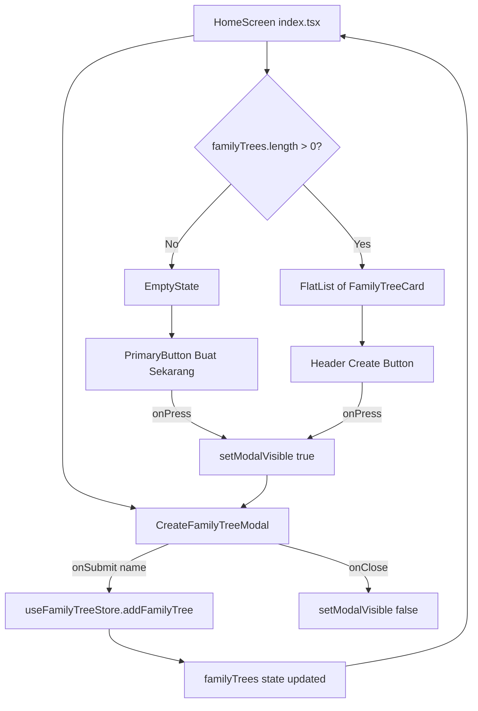
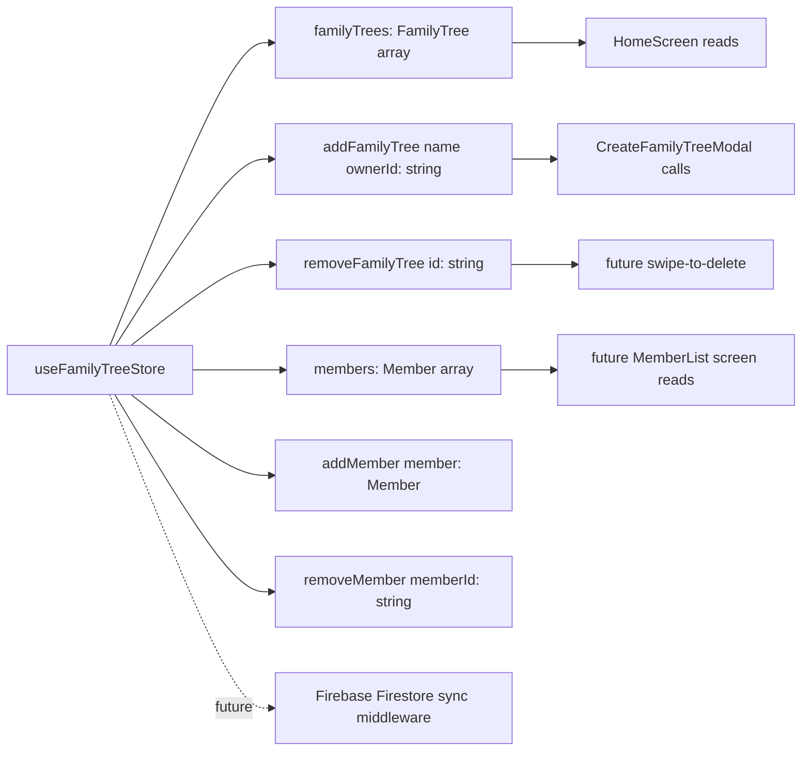
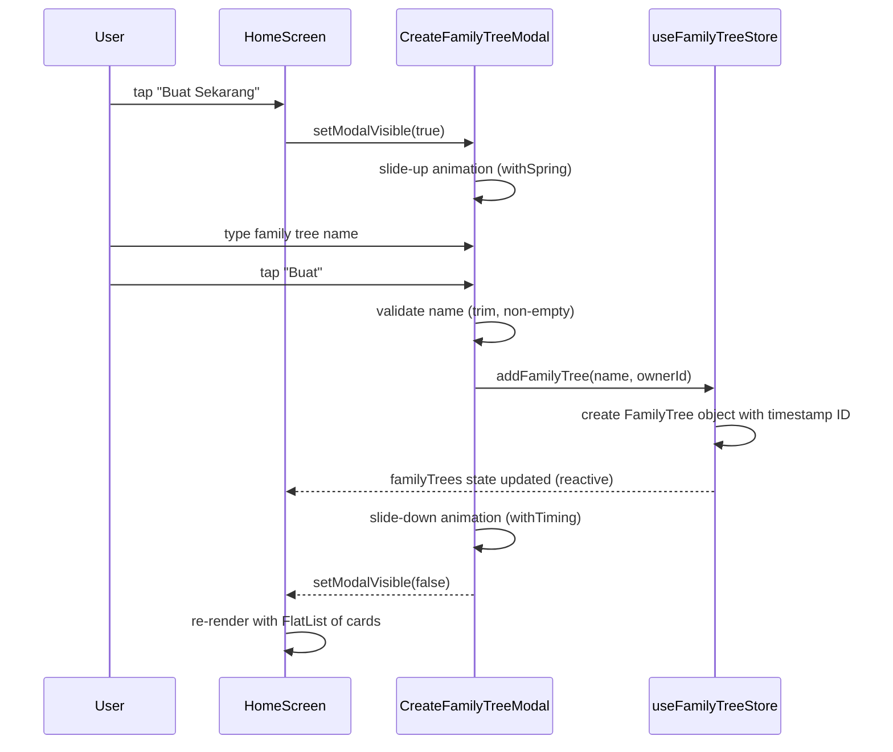
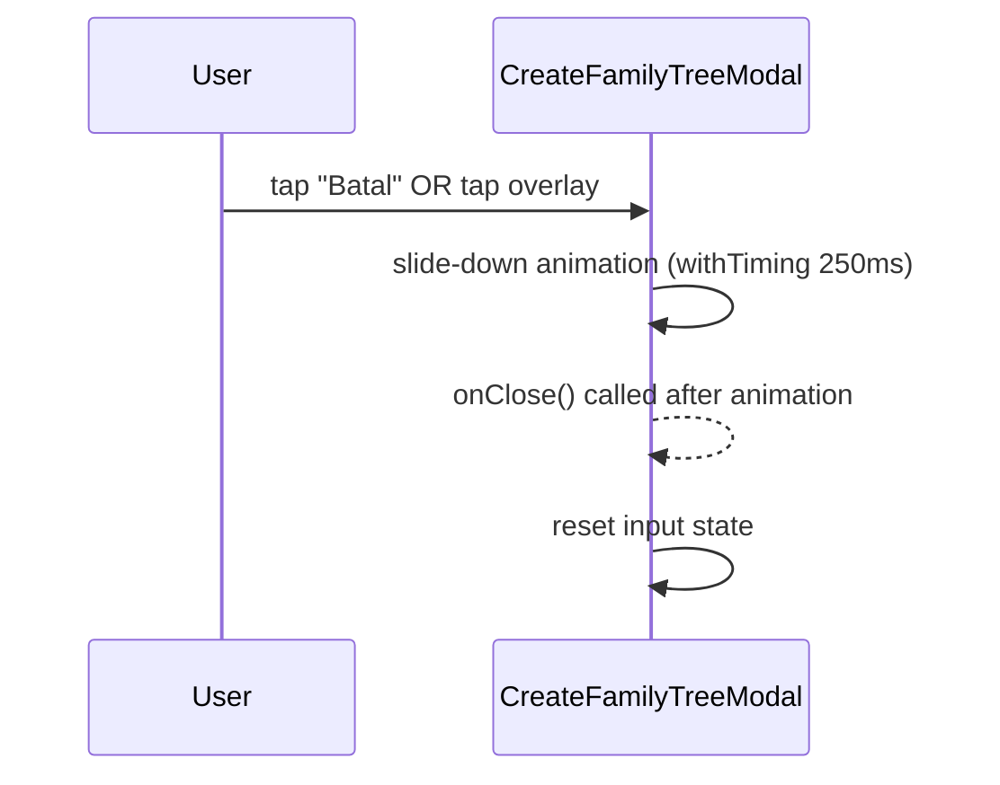

# Design Document: Create Family Tree

## Overview

This feature implements the "Create Family Tree" flow for the AsalUsul mobile app (Step 3). When the user taps "Buat Sekarang" on the Home Screen, an animated modal opens where they enter a family tree name and submit it. The newly created family tree then appears as a card in a list on the Home Screen. All state is managed locally with Zustand (no Firebase in this step). The design is Firebase-ready — the store structure is shaped to allow future sync with minimal refactoring.

The implementation adds three new components (`FamilyTreeCard`, `CreateFamilyTreeModal`, `EmptyState`), one Zustand store (`useFamilyTreeStore`), and updates the Home Screen to conditionally render either the empty state or the family tree list.

---

## Architecture

### Component & Data Flow



### State Management Architecture



### File Structure

```
src/
  store/
    useFamilyTreeStore.ts       ← NEW: Zustand store (FamilyTree + Member)
  types/
    familyTree.ts               ← NEW: FamilyTree and Member TypeScript interfaces
  components/
    family/
      FamilyTreeCard.tsx        ← NEW: premium card component
      CreateFamilyTreeModal.tsx ← NEW: animated modal
      EmptyState.tsx            ← NEW: extracted empty state
  app/
    (tabs)/
      index.tsx                 ← UPDATED: conditional render + modal wiring
```

---

## Sequence Diagrams

### Create Family Tree Flow



### Cancel / Dismiss Flow



---

## Components and Interfaces

### 1. `useFamilyTreeStore` — `src/store/useFamilyTreeStore.ts`

**Purpose**: Single source of truth for all family tree and member data. Structured for future Firebase sync.

**Interface**:

```typescript
export interface FamilyTree {
  id: string;           // Date.now().toString() — timestamp-based, no uuid dep needed
  name: string;         // user-provided, trimmed
  description: string | null;  // optional description of the family tree
  coverImage: string | null;   // optional cover image URL
  ownerId: string;      // references the user who owns this tree
  createdAt: string;    // ISO 8601 date string: new Date().toISOString()
  updatedAt: string;    // ISO 8601 date string: updated on any mutation
  totalMembers: number; // incremented/decremented as members are added/removed
}

export interface Member {
  id: string;                  // unique member ID
  familyTreeId: string;        // reference to parent FamilyTree
  fullName: string;            // full name of the member
  gender: 'male' | 'female';  // gender enum
  role: string;                // role in family: "Ayah", "Ibu", "Anak", "Cucu", "Kakek", etc.
  birthDate: string | null;    // "YYYY-MM-DD" format or null
  photoUrl: string | null;     // optional photo URL
  bio: string | null;          // optional biography
  fatherId: string | null;     // reference to father member ID
  motherId: string | null;     // reference to mother member ID
  spouseIds: string[];         // array of spouse member IDs
  childrenIds: string[];       // array of children member IDs
  createdAt: string;           // ISO 8601 date string
}

interface FamilyTreeState {
  familyTrees: FamilyTree[];
  members: Member[];
}

interface FamilyTreeActions {
  addFamilyTree: (name: string, ownerId: string) => void;
  removeFamilyTree: (id: string) => void;
  addMember: (member: Omit<Member, 'id' | 'createdAt'>) => void;
  removeMember: (memberId: string) => void;
}

export type FamilyTreeStore = FamilyTreeState & FamilyTreeActions;
```

**Responsibilities**:
- Expose `familyTrees` array and `members` array as reactive state
- `addFamilyTree(name, ownerId)`: create a new `FamilyTree` with timestamp ID, trimmed name, ISO `createdAt` and `updatedAt`, `totalMembers: 0`, `description: null`, `coverImage: null`; prepend to array (newest first)
- `removeFamilyTree(id)`: filter out the entry with matching `id` and all associated members
- `addMember(member)`: create a new `Member` with generated ID and ISO `createdAt`; append to `members` array; increment `totalMembers` on the corresponding FamilyTree; enforce bidirectional relationship consistency
- `removeMember(memberId)`: remove the member from `members`; decrement `totalMembers` on the corresponding FamilyTree; clean up all references to `memberId` in other members' `spouseIds`, `childrenIds`, `fatherId`, and `motherId`
- Shape is Firebase-ready: each `FamilyTree` maps 1:1 to a Firestore document at `users/{uid}/familyTrees/{id}`; each `Member` maps 1:1 to a Firestore document at `users/{uid}/familyTrees/{familyTreeId}/members/{id}`

---

### 2. `FamilyTreeCard` — `src/components/family/FamilyTreeCard.tsx`

**Purpose**: Premium card displaying a single family tree entry in the Home Screen list.

**Interface**:

```typescript
export interface FamilyTreeCardProps {
  item: FamilyTree;
  onPress?: (id: string) => void;
}
```

**Responsibilities**:
- Display `item.name` as heading (`ThemedText type="subtitle"` with fontSize override 18)
- Display member count: `"${item.totalMembers} Anggota"` (`ThemedText type="small"`, muted color)
- Display relative date: `formatRelativeDate(item.createdAt)` → `"Dibuat N hari lalu"` or `"Dibuat hari ini"`
- Left avatar: rounded square with `Ionicons "git-network-outline"` on `AsalUsulColors.backgroundOverlay`
- Right: `Ionicons "chevron-forward"` in `AsalUsulColors.textMuted`
- Style: `borderRadius: Radii.lg`, `backgroundColor: AsalUsulColors.backgroundCard`, `...Shadows.card`
- Press feedback via `Pressable` opacity

---

### 3. `CreateFamilyTreeModal` — `src/components/family/CreateFamilyTreeModal.tsx`

**Purpose**: Animated bottom-sheet-style modal for entering a new family tree name.

**Interface**:

```typescript
export interface CreateFamilyTreeModalProps {
  visible: boolean;
  onClose: () => void;
  onSubmit: (name: string) => void;
}
```

**Responsibilities**:
- Render React Native `<Modal>` with `transparent={true}`, `animationType="none"` (Reanimated handles animation)
- Dark overlay: `rgba(0,0,0,0.5)` full-screen `Pressable` (tap to dismiss)
- Inner sheet: card-colored rounded-top container, slides up from bottom via `translateY` shared value
- Title: `"Buat Pohon Keluarga"` (`ThemedText type="subtitle"` with fontSize override)
- Description: short helper text in `AsalUsulColors.textMuted`
- `TextInput` with placeholder `"Contoh: Keluarga Sastrawinata"`, `autoFocus`, `returnKeyType="done"`
- Two buttons: `PrimaryButton variant="outline" label="Batal"` + `PrimaryButton variant="filled" label="Buat"`
- Validation: `name.trim().length > 0` before calling `onSubmit`; submit button disabled when invalid
- Animation: `translateY` shared value, `withSpring` on open, `withTiming` on close
- Reset `inputValue` to `""` after close animation completes via `runOnJS`

---

### 4. `EmptyState` — `src/components/family/EmptyState.tsx`

**Purpose**: Extracted empty state UI from the current Home Screen. Shown when `familyTrees.length === 0`.

**Interface**:

```typescript
export interface EmptyStateProps {
  onCreatePress: () => void;
}
```

**Responsibilities**:
- Render `HeroIllustration`, heading `"Belum ada pohon keluarga"`, description text, and `PrimaryButton "Buat Sekarang"`
- Preserve existing `FadeInDown` stagger animations from the current `index.tsx`
- Delegate button press to `onCreatePress` prop

---

### 5. `HomeScreen` (updated) — `src/app/(tabs)/index.tsx`

**Purpose**: Conditionally renders empty state or family tree list based on store state.

**Responsibilities**:
- Read `familyTrees` and `addFamilyTree` from `useFamilyTreeStore`
- Manage `modalVisible: boolean` local state via `useState`
- When `familyTrees.length === 0`: render `<EmptyState onCreatePress={() => setModalVisible(true)} />`
- When `familyTrees.length > 0`: render `FlatList` of `FamilyTreeCard` + a "Buat" button in the header area
- Always render `<CreateFamilyTreeModal visible={modalVisible} onClose={...} onSubmit={...} />`
- On modal submit: call `addFamilyTree(name, ownerId)` then close modal

---

## Data Models

### `FamilyTree`

```typescript
export interface FamilyTree {
  id: string;                  // Date.now().toString() — unique per session
  name: string;                // trimmed, non-empty
  description: string | null;  // optional description, null by default
  coverImage: string | null;   // optional cover image URL, null by default
  ownerId: string;             // non-empty, references the owning user
  createdAt: string;           // ISO 8601: "2025-01-15T10:30:00.000Z"
  updatedAt: string;           // ISO 8601: equals createdAt at creation; updated on mutations
  totalMembers: number;        // non-negative integer, default 0
}
```

**Validation Rules**:
- `id`: non-empty string, unique within the store
- `name`: trimmed length ≥ 1 character
- `description`: `null` or non-empty string
- `coverImage`: `null` or valid URL string
- `ownerId`: non-empty string
- `createdAt`: valid ISO 8601 date string
- `updatedAt`: valid ISO 8601 date string, `updatedAt >= createdAt`
- `totalMembers`: non-negative integer

---

### `Member`

```typescript
export interface Member {
  id: string;                  // unique member ID
  familyTreeId: string;        // references FamilyTree.id
  fullName: string;            // non-empty
  gender: 'male' | 'female';  // strict enum
  role: string;                // non-empty: "Ayah", "Ibu", "Anak", "Cucu", "Kakek", etc.
  birthDate: string | null;    // "YYYY-MM-DD" or null
  photoUrl: string | null;     // valid URL or null
  bio: string | null;          // any string or null
  fatherId: string | null;     // references Member.id in same tree, or null
  motherId: string | null;     // references Member.id in same tree, or null
  spouseIds: string[];         // array of Member.id in same tree
  childrenIds: string[];       // array of Member.id in same tree
  createdAt: string;           // ISO 8601
}
```

**Validation Rules**:
- `id`: non-empty string, unique within the store
- `familyTreeId`: must reference an existing `FamilyTree.id`
- `fullName`: non-empty string
- `gender`: exactly `"male"` or `"female"`
- `role`: non-empty string
- `birthDate`: `null` or string matching `/^\d{4}-\d{2}-\d{2}$/` representing a valid calendar date
- `photoUrl`: `null` or valid URL string
- `fatherId` / `motherId`: `null` or references an existing `Member.id` in the same FamilyTree
- `spouseIds` / `childrenIds`: arrays of existing `Member.id` values in the same FamilyTree
- `createdAt`: valid ISO 8601 date string

### Store Shape (Firebase-ready)

```typescript
// FamilyTree maps to Firestore collection: users/{uid}/familyTrees/{id}
// Member maps to Firestore collection: users/{uid}/familyTrees/{familyTreeId}/members/{id}
// Each document field maps 1:1 to the interface above
// Future sync: add syncStatus: 'local' | 'synced' | 'error' field per entry
```

---

## Algorithmic Pseudocode

### `addFamilyTree` Store Action

```typescript
function addFamilyTree(name: string, ownerId: string): void
```

**Preconditions**: `name.trim().length >= 1`, `ownerId.length >= 1`

**Postconditions**:
- A new `FamilyTree` is prepended to `familyTrees`
- The new entry has a unique `id`, trimmed `name`, valid ISO `createdAt` and `updatedAt` (equal at creation), `totalMembers: 0`, `description: null`, `coverImage: null`, and the provided `ownerId`
- `familyTrees.length` increases by exactly 1

```pascal
PROCEDURE addFamilyTree(name, ownerId)
  INPUT: name of type string, ownerId of type string
  OUTPUT: side-effect — updates familyTrees state

  BEGIN
    trimmedName ← name.trim()
    ASSERT trimmedName.length >= 1
    ASSERT ownerId.length >= 1

    now ← new Date().toISOString()

    newTree ← {
      id:           Date.now().toString(),
      name:         trimmedName,
      description:  null,
      coverImage:   null,
      ownerId:      ownerId,
      createdAt:    now,
      updatedAt:    now,
      totalMembers: 0
    }

    set(state => { familyTrees: [newTree, ...state.familyTrees] })
  END
END PROCEDURE
```

---

### `removeFamilyTree` Store Action

```typescript
function removeFamilyTree(id: string): void
```

**Preconditions**: `id` is a non-empty string (need not exist — idempotent)

**Postconditions**:
- No entry with `id` exists in `familyTrees`
- All other entries are unchanged and in original order

```pascal
PROCEDURE removeFamilyTree(id)
  INPUT: id of type string
  OUTPUT: side-effect — updates familyTrees state

  BEGIN
    set(state => {
      familyTrees: state.familyTrees.filter(tree => tree.id !== id)
    })
  END
END PROCEDURE
```

---

### `addMember` Store Action

```typescript
function addMember(member: Omit<Member, 'id' | 'createdAt'>): void
```

**Preconditions**:
- `member.familyTreeId` references an existing `FamilyTree.id` in the store
- `member.fullName.length >= 1`
- `member.gender` is `"male"` or `"female"`
- `member.role.length >= 1`

**Postconditions**:
- A new `Member` is appended to `members` with a generated `id` and ISO `createdAt`
- `totalMembers` on the corresponding FamilyTree is incremented by 1
- `updatedAt` on the corresponding FamilyTree is updated to the current ISO timestamp
- Bidirectional relationship consistency is enforced (spouse symmetry, parent-child links)
- `members.length` increases by exactly 1

```pascal
PROCEDURE addMember(memberData)
  INPUT: memberData of type Omit<Member, 'id' | 'createdAt'>
  OUTPUT: side-effect — updates members state and corresponding FamilyTree

  BEGIN
    ASSERT memberData.familyTreeId exists in familyTrees
    ASSERT memberData.fullName.length >= 1
    ASSERT memberData.gender IN ["male", "female"]
    ASSERT memberData.role.length >= 1

    now ← new Date().toISOString()

    newMember ← {
      id:           Date.now().toString(),
      createdAt:    now,
      ...memberData
    }

    // Enforce spouse symmetry
    FOR EACH spouseId IN newMember.spouseIds DO
      UPDATE members WHERE id = spouseId:
        spouseIds ← [...spouseIds, newMember.id]  // if not already present
    END FOR

    // Enforce parent-child consistency
    FOR EACH childId IN newMember.childrenIds DO
      UPDATE members WHERE id = childId:
        IF newMember.gender = "male" THEN
          fatherId ← newMember.id
        ELSE
          motherId ← newMember.id
        END IF
    END FOR

    set(state => {
      members: [...state.members, newMember],
      familyTrees: state.familyTrees.map(tree =>
        tree.id = newMember.familyTreeId
          ? { ...tree, totalMembers: tree.totalMembers + 1, updatedAt: now }
          : tree
      )
    })
  END
END PROCEDURE
```

---

### `removeMember` Store Action

```typescript
function removeMember(memberId: string): void
```

**Preconditions**: `memberId` is a non-empty string (need not exist — idempotent)

**Postconditions**:
- No member with `memberId` exists in `members`
- All references to `memberId` are removed from `spouseIds`, `childrenIds`, `fatherId`, and `motherId` of all other members in the same FamilyTree
- `totalMembers` on the corresponding FamilyTree is decremented by 1 (if the member existed)
- `updatedAt` on the corresponding FamilyTree is updated to the current ISO timestamp (if the member existed)

```pascal
PROCEDURE removeMember(memberId)
  INPUT: memberId of type string
  OUTPUT: side-effect — updates members state and corresponding FamilyTree

  BEGIN
    target ← members.find(m => m.id = memberId)
    IF target IS NULL THEN RETURN  // idempotent — no-op

    now ← new Date().toISOString()

    // Clean up all references in sibling members
    set(state => {
      members: state.members
        .filter(m => m.id ≠ memberId)
        .map(m => {
          IF m.familyTreeId ≠ target.familyTreeId THEN RETURN m
          RETURN {
            ...m,
            spouseIds:   m.spouseIds.filter(id => id ≠ memberId),
            childrenIds: m.childrenIds.filter(id => id ≠ memberId),
            fatherId:    m.fatherId = memberId ? null : m.fatherId,
            motherId:    m.motherId = memberId ? null : m.motherId
          }
        }),
      familyTrees: state.familyTrees.map(tree =>
        tree.id = target.familyTreeId
          ? { ...tree, totalMembers: tree.totalMembers - 1, updatedAt: now }
          : tree
      )
    })
  END
END PROCEDURE
```

---

```typescript
// Shared value: translateY (0 = fully visible, SHEET_HEIGHT = off-screen below)
const SHEET_HEIGHT = 380
const translateY = useSharedValue(SHEET_HEIGHT)
const animatedStyle = useAnimatedStyle(() => ({
  transform: [{ translateY: translateY.value }]
}))
```

**Open animation** (triggered when `visible` prop transitions `false → true`):

```pascal
PROCEDURE openModal()
  BEGIN
    translateY.value ← withSpring(0, {
      damping: 20,
      stiffness: 200,
      mass: 0.8
    })
  END
END PROCEDURE
```

**Close animation** (triggered on "Batal" press or overlay tap):

```pascal
PROCEDURE closeModal(onClose)
  INPUT: onClose callback
  BEGIN
    translateY.value ← withTiming(SHEET_HEIGHT, {
      duration: 250,
      easing: Easing.out(Easing.cubic)
    }, runOnJS(onClose))
    // runOnJS(onClose) fires after animation completes on UI thread
  END
END PROCEDURE
```

**Preconditions**:
- `SHEET_HEIGHT` constant matches the sheet's rendered height
- `translateY` initialized to `SHEET_HEIGHT` (off-screen below viewport)

**Postconditions (open)**:
- `translateY.value === 0` after spring settles; sheet fully visible

**Postconditions (close)**:
- `translateY.value === SHEET_HEIGHT` after timing completes
- `onClose()` called exactly once via `runOnJS`

**Loop Invariants**: N/A (no loops; animation is a single value transition)

---

### Input Validation

```typescript
function validateFamilyTreeName(name: string): boolean
```

**Preconditions**: `name` is a string (may be empty)

**Postconditions**: Returns `true` if and only if `name.trim().length >= 1`

```pascal
FUNCTION validateFamilyTreeName(name)
  INPUT: name of type string
  OUTPUT: isValid of type boolean

  BEGIN
    RETURN name.trim().length >= 1
  END
END FUNCTION
```

---

### `formatRelativeDate` Utility

```typescript
function formatRelativeDate(isoDate: string): string
```

**Preconditions**: `isoDate` is a valid ISO 8601 date string

**Postconditions**:
- Returns `"Dibuat hari ini"` if the date is today (diffDays ≤ 0)
- Returns `"Dibuat N hari lalu"` where N ≥ 1 for past dates

```pascal
FUNCTION formatRelativeDate(isoDate)
  INPUT: isoDate of type string
  OUTPUT: label of type string

  BEGIN
    created  ← new Date(isoDate)
    now      ← new Date()
    diffMs   ← now.getTime() - created.getTime()
    diffDays ← Math.floor(diffMs / (1000 * 60 * 60 * 24))

    IF diffDays <= 0 THEN
      RETURN "Dibuat hari ini"
    ELSE
      RETURN "Dibuat " + diffDays + " hari lalu"
    END IF
  END
END FUNCTION
```

---

## Key Functions with Formal Specifications

### `useFamilyTreeStore` hook

```typescript
export const useFamilyTreeStore = create<FamilyTreeStore>()((set) => ({
  familyTrees: [],
  members: [],
  addFamilyTree: (name: string, ownerId: string) => void,
  removeFamilyTree: (id: string) => void,
  addMember: (member: Omit<Member, 'id' | 'createdAt'>) => void,
  removeMember: (memberId: string) => void,
}))
```

**Preconditions**: Called inside a React component or custom hook

**Postconditions**:
- Returns reactive `familyTrees` array, `members` array, and action functions
- State updates trigger re-renders in all subscribed components

---

### `CreateFamilyTreeModal` component

```typescript
export function CreateFamilyTreeModal({
  visible,
  onClose,
  onSubmit,
}: CreateFamilyTreeModalProps): JSX.Element
```

**Preconditions**:
- `onClose` and `onSubmit` are stable references (memoized by parent with `useCallback`)
- `react-native-reanimated` is configured in `babel.config.js`

**Postconditions**:
- `visible` `false → true`: open animation runs, `TextInput` auto-focuses
- `visible` `true → false`: close animation runs, `onClose` called after animation
- `onSubmit` called with trimmed name only when `validateFamilyTreeName` returns `true`
- Input reset to `""` after close

---

### `FamilyTreeCard` component

```typescript
export function FamilyTreeCard({ item, onPress }: FamilyTreeCardProps): JSX.Element
```

**Preconditions**: `item` is a valid `FamilyTree` object with all required fields

**Postconditions**:
- Renders `item.name`, member count string, and relative date string
- Calls `onPress(item.id)` when pressed (if `onPress` is provided)
- No mutations to `item`

---

### `EmptyState` component

```typescript
export function EmptyState({ onCreatePress }: EmptyStateProps): JSX.Element
```

**Preconditions**: `onCreatePress` is a valid function reference

**Postconditions**:
- Renders hero illustration, heading, description, and CTA button
- Calls `onCreatePress` when button is pressed

---

## Screen Layouts

### Home Screen — Empty State

```
┌─────────────────────────────────┐
│  SafeAreaView                   │
│  ┌─────────────────────────┐    │
│  │ AsalUsul          [🔔]  │    │  ← HomeHeader (unchanged)
│  └─────────────────────────┘    │
│                                 │
│  ┌─────────────────────────┐    │
│  │    [tree icon 64px]     │    │  ← HeroIllustration
│  └─────────────────────────┘    │
│                                 │
│  Belum ada pohon keluarga       │  ← subtitle, centered
│  Mulai buat pohon keluarga...   │  ← body muted, centered
│                                 │
│  ╔═══════════════════════════╗  │
│  ║      Buat Sekarang        ║  │  ← PrimaryButton filled
│  ╚═══════════════════════════╝  │
└─────────────────────────────────┘
Background: AsalUsulColors.backgroundWarm (#F5F0E8)
```

### Home Screen — With Family Trees

```
┌─────────────────────────────────┐
│  SafeAreaView                   │
│  ┌─────────────────────────┐    │
│  │ AsalUsul   [+ Buat] [🔔]│    │  ← HomeHeader + create button
│  └─────────────────────────┘    │
│                                 │
│  ┌─────────────────────────┐    │
│  │ [🌳] Keluarga Budi   ›  │    │  ← FamilyTreeCard
│  │      0 Anggota          │    │
│  │      Dibuat hari ini    │    │
│  └─────────────────────────┘    │
│  ┌─────────────────────────┐    │
│  │ [🌳] Keluarga Sari   ›  │    │  ← FamilyTreeCard
│  │      0 Anggota          │    │
│  │      Dibuat 2 hari lalu │    │
│  └─────────────────────────┘    │
└─────────────────────────────────┘
```

### CreateFamilyTreeModal — Bottom Sheet

```
┌─────────────────────────────────┐
│                                 │
│  ░░░░ dark overlay ░░░░░░░░░░░  │  ← rgba(0,0,0,0.5) Pressable
│                                 │
│  ┌─────────────────────────┐    │
│  │ ─────── (drag handle)   │    │  ← decorative pill
│  │                         │    │
│  │  Buat Pohon Keluarga    │    │  ← title
│  │  Beri nama pohon...     │    │  ← description muted
│  │                         │    │
│  │  ┌───────────────────┐  │    │
│  │  │ Keluarga Sastra…  │  │    │  ← TextInput
│  │  └───────────────────┘  │    │
│  │                         │    │
│  │  [  Batal  ] [  Buat  ] │    │  ← outline + filled buttons
│  └─────────────────────────┘    │
└─────────────────────────────────┘
Sheet background: AsalUsulColors.backgroundCard (#FDFAF4)
```

---

## Error Handling

### Error Scenario 1: Empty / Whitespace Name Submission

**Condition**: User taps "Buat" with an empty or whitespace-only `TextInput`
**Response**: Submit button is disabled (`disabled={!isNameValid}`) — no action taken
**Recovery**: User types a valid name; button re-enables reactively via `isNameValid` derived state

### Error Scenario 2: Duplicate Family Tree Name

**Condition**: User creates two trees with the same name
**Response**: Allowed — `id` is timestamp-based and unique; names are not required to be unique
**Recovery**: N/A

### Error Scenario 3: Modal Dismissed Mid-Animation

**Condition**: User taps overlay while open animation is still running
**Response**: Close animation starts immediately; `withTiming` overrides the in-progress `withSpring`
**Recovery**: Reanimated handles animation interruption gracefully — no crash or stuck state

### Error Scenario 4: Store Used Outside React Tree

**Condition**: `useFamilyTreeStore` called outside a React component
**Response**: React hooks rules violation — throws at runtime
**Recovery**: Only call `useFamilyTreeStore` inside React components or custom hooks

---

## Testing Strategy

### Unit Testing Approach

Each new module is tested in isolation using `@testing-library/react-native` and `jest`:

- **`useFamilyTreeStore`**: `addFamilyTree` adds entry with correct shape; `removeFamilyTree` removes entry; initial state is empty arrays; `addFamilyTree` prepends (newest first); `addMember` appends member and increments `totalMembers`; `removeMember` removes member, decrements `totalMembers`, and cleans up references
- **`FamilyTreeCard`**: renders name, member count, relative date; calls `onPress` with correct id on press
- **`CreateFamilyTreeModal`**: renders when `visible=true`; does not render content when `visible=false`; calls `onSubmit` with trimmed name; does not call `onSubmit` for empty input; calls `onClose` on cancel press
- **`EmptyState`**: renders all expected text; calls `onCreatePress` on button press
- **`formatRelativeDate`**: returns `"Dibuat hari ini"` for today; returns `"Dibuat N hari lalu"` for past dates
- **`validateFamilyTreeName`**: returns `true` for non-empty strings; returns `false` for empty/whitespace

### Property-Based Testing Approach

**Property Test Library**: `fast-check` (already installed as devDependency)

Key properties:

1. **`addFamilyTree` length invariant**: For any N valid `addFamilyTree` calls, `familyTrees.length === N`
2. **`addFamilyTree` name preservation**: For any non-empty string `name`, stored tree's `name === name.trim()`
3. **`removeFamilyTree` idempotency**: Calling `removeFamilyTree(id)` twice produces same result as once
4. **`validateFamilyTreeName` invariant**: Returns `true` iff `name.trim().length >= 1`
5. **`formatRelativeDate` format invariant**: For any valid ISO date, result always starts with `"Dibuat "`
6. **`FamilyTreeCard` name display invariant**: For any valid `FamilyTree`, card always renders `item.name`
7. **`addFamilyTree` unique ID invariant**: All resulting `id` values are unique across N calls
8. **`addFamilyTree` correct shape invariant**: Created FamilyTree has `totalMembers === 0`, `description === null`, `coverImage === null`, valid ISO `createdAt` and `updatedAt`, non-empty `ownerId`
9. **`addMember` totalMembers invariant**: For any N `addMember` calls on the same tree, `totalMembers === N`
10. **Member correct shape invariant**: For any created Member, `gender` is `"male"` or `"female"`, `spouseIds` and `childrenIds` are arrays, `createdAt` is valid ISO 8601
11. **Member familyTreeId consistency**: For any added Member, `member.familyTreeId` equals the target FamilyTree's `id`
12. **Spouse symmetry invariant**: For any two Members A and B, if A's `spouseIds` contains B's `id`, then B's `spouseIds` contains A's `id`
13. **Parent-child consistency invariant**: For any two Members A and B, if A's `childrenIds` contains B's `id`, then B's `fatherId` or `motherId` equals A's `id`
14. **Member birthDate format invariant**: For any Member with non-null `birthDate`, the value matches `"YYYY-MM-DD"` pattern

### Integration Testing Approach

- **HomeScreen empty → list transition**: mock store with 0 trees, verify empty state renders; add a tree, verify `FamilyTreeCard` appears
- **Full create flow**: render `HomeScreen`, press "Buat Sekarang", fill modal input, press "Buat", verify card appears in list and modal closes

---

## Performance Considerations

- **`FlatList` with `keyExtractor`**: uses `item.id` as key — avoids full re-renders on list updates
- **`useSharedValue` / `useAnimatedStyle`**: modal animation runs entirely on the UI thread via Reanimated worklets — no JS bridge overhead
- **Zustand subscriptions**: components subscribe only to the slice they need — no unnecessary re-renders from unrelated state
- **`StyleSheet.create`**: all styles are frozen and registered natively — no per-render object allocation
- **`Pressable` opacity feedback**: native-driven press animation — no JS thread involvement

---

## Security Considerations

- **No network requests**: all data is local Zustand state — no attack surface in this step
- **Input sanitization**: `name.trim()` removes leading/trailing whitespace before storage
- **No PII stored beyond user-provided name**: `FamilyTree` contains only name, timestamp, and member count
- **Firebase-ready shape**: when Firebase sync is added, use Firestore security rules to restrict read/write to `users/{uid}/familyTrees` path

---

## Correctness Properties

*A property is a characteristic or behavior that should hold true across all valid executions of a system — essentially, a formal statement about what the system should do. Properties serve as the bridge between human-readable specifications and machine-verifiable correctness guarantees.*

### Property 1: `addFamilyTree` length invariant

*For any* sequence of N calls to `addFamilyTree` with valid names, `familyTrees.length === N`.

```typescript
fc.assert(
  fc.property(
    fc.array(
      fc.string({ minLength: 1 }).map(s => s.trim()).filter(s => s.length > 0),
      { minLength: 1, maxLength: 20 }
    ),
    (names) => {
      const store = createTestStore();
      names.forEach(name => store.getState().addFamilyTree(name, 'user_001'));
      expect(store.getState().familyTrees).toHaveLength(names.length);
    }
  )
);
```

**Validates: Requirement 3.3**

### Property 2: `addFamilyTree` name preservation invariant

*For any* non-empty string `name`, the stored tree's `name` equals `name.trim()`.

```typescript
fc.assert(
  fc.property(
    fc.string({ minLength: 1 }).filter(s => s.trim().length > 0),
    (name) => {
      const store = createTestStore();
      store.getState().addFamilyTree(name, 'user_001');
      const [tree] = store.getState().familyTrees;
      expect(tree.name).toBe(name.trim());
    }
  )
);
```

**Validates: Requirements 3.4, 8.3**

### Property 3: `removeFamilyTree` idempotency invariant

*For any* `id`, calling `removeFamilyTree(id)` twice produces the same `familyTrees` as calling it once.

```typescript
fc.assert(
  fc.property(
    fc.string({ minLength: 1 }).filter(s => s.trim().length > 0),
    (name) => {
      const store = createTestStore();
      store.getState().addFamilyTree(name, 'user_001');
      const id = store.getState().familyTrees[0].id;
      store.getState().removeFamilyTree(id);
      const afterFirst = [...store.getState().familyTrees];
      store.getState().removeFamilyTree(id);
      expect(store.getState().familyTrees).toEqual(afterFirst);
    }
  )
);
```

**Validates: Requirement 3.12**

### Property 4: `validateFamilyTreeName` invariant

*For any* string `name`, `validateFamilyTreeName(name)` returns `true` if and only if `name.trim().length >= 1`.

```typescript
fc.assert(
  fc.property(fc.string(), (name) => {
    expect(validateFamilyTreeName(name)).toBe(name.trim().length >= 1);
  })
);
```

**Validates: Requirements 5.1, 5.2, 5.3**

### Property 5: `formatRelativeDate` format invariant

*For any* valid ISO date string, the result always starts with `"Dibuat "`.

```typescript
fc.assert(
  fc.property(
    fc.date({ min: new Date('2020-01-01'), max: new Date() }).map(d => d.toISOString()),
    (isoDate) => {
      expect(formatRelativeDate(isoDate)).toMatch(/^Dibuat /);
    }
  )
);
```

**Validates: Requirements 6.3, 6.4**

### Property 6: `FamilyTreeCard` renders all required data invariant

*For any* valid `FamilyTree` object, the card always renders `item.name`, the member count string, and a relative date string starting with `"Dibuat "`.

```typescript
fc.assert(
  fc.property(
    fc.record({
      id: fc.string({ minLength: 1 }),
      name: fc.string({ minLength: 1 }),
      description: fc.constant(null),
      coverImage: fc.constant(null),
      ownerId: fc.string({ minLength: 1 }),
      createdAt: fc.date({ min: new Date('2020-01-01'), max: new Date() }).map(d => d.toISOString()),
      updatedAt: fc.date({ min: new Date('2020-01-01'), max: new Date() }).map(d => d.toISOString()),
      totalMembers: fc.nat(),
    }),
    (item) => {
      const { queryByText, getByText, unmount } = render(<FamilyTreeCard item={item} />);
      expect(queryByText(item.name)).not.toBeNull();
      expect(queryByText(`${item.totalMembers} Anggota`)).not.toBeNull();
      const dateLabel = getByText(/^Dibuat /);
      expect(dateLabel).not.toBeNull();
      unmount();
    }
  )
);
```

**Validates: Requirements 4.1, 4.2, 4.3**

### Property 7: `addFamilyTree` unique ID invariant

*For any* sequence of N `addFamilyTree` calls, all resulting `id` values are unique.

```typescript
fc.assert(
  fc.property(
    fc.array(
      fc.string({ minLength: 1 }).filter(s => s.trim().length > 0),
      { minLength: 2, maxLength: 10 }
    ),
    (names) => {
      const store = createTestStore();
      names.forEach((name, i) => {
        jest.spyOn(Date, 'now').mockReturnValue(i + 1);
        store.getState().addFamilyTree(name, 'user_001');
      });
      const ids = store.getState().familyTrees.map(t => t.id);
      expect(new Set(ids).size).toBe(ids.length);
    }
  )
);
```

**Validates: Requirements 3.5, 8.2**

### Property 8: `addFamilyTree` correct shape invariant

*For any* valid name and ownerId, the FamilyTree created by `addFamilyTree(name, ownerId)` has `totalMembers === 0`, `description === null`, `coverImage === null`, a valid ISO 8601 `createdAt` string, a valid ISO 8601 `updatedAt` string equal to `createdAt`, a non-empty `id`, `name === name.trim()`, and `ownerId` equal to the provided ownerId.

```typescript
fc.assert(
  fc.property(
    fc.string({ minLength: 1 }).filter(s => s.trim().length > 0),
    fc.string({ minLength: 1 }),
    (name, ownerId) => {
      const store = createTestStore();
      store.getState().addFamilyTree(name, ownerId);
      const [tree] = store.getState().familyTrees;
      expect(tree.totalMembers).toBe(0);
      expect(tree.description).toBeNull();
      expect(tree.coverImage).toBeNull();
      expect(tree.id.length).toBeGreaterThan(0);
      expect(tree.name).toBe(name.trim());
      expect(tree.ownerId).toBe(ownerId);
      expect(() => new Date(tree.createdAt)).not.toThrow();
      expect(new Date(tree.createdAt).toISOString()).toBe(tree.createdAt);
      expect(tree.updatedAt).toBe(tree.createdAt);
    }
  )
);
```

**Validates: Requirements 3.6, 3.7, 3.8, 8.1, 8.4, 8.5, 8.6, 8.7, 8.8, 8.9**

### Property 9: `addFamilyTree` prepend invariant

*For any* sequence of `addFamilyTree` calls, the most recently added FamilyTree is always at index 0 of `familyTrees`.

```typescript
fc.assert(
  fc.property(
    fc.array(
      fc.string({ minLength: 1 }).filter(s => s.trim().length > 0),
      { minLength: 2, maxLength: 10 }
    ),
    (names) => {
      const store = createTestStore();
      names.forEach(name => store.getState().addFamilyTree(name, 'user_001'));
      const lastAdded = names[names.length - 1].trim();
      expect(store.getState().familyTrees[0].name).toBe(lastAdded);
    }
  )
);
```

**Validates: Requirement 3.2**

### Property 10: `removeFamilyTree` preserves other entries invariant

*For any* FamilyTreeStore state with N entries, calling `removeFamilyTree(id)` for one entry leaves all other N-1 entries unchanged and in their original order.

```typescript
fc.assert(
  fc.property(
    fc.array(
      fc.string({ minLength: 1 }).filter(s => s.trim().length > 0),
      { minLength: 2, maxLength: 10 }
    ),
    (names) => {
      const store = createTestStore();
      names.forEach(name => store.getState().addFamilyTree(name, 'user_001'));
      const trees = store.getState().familyTrees;
      const idToRemove = trees[0].id;
      const remaining = trees.slice(1);
      store.getState().removeFamilyTree(idToRemove);
      expect(store.getState().familyTrees).toEqual(remaining);
    }
  )
);
```

**Validates: Requirement 3.11**

---

### Property 11: Member correct shape invariant

*For any* Member created via `addMember`, the member has a non-empty `id`, a non-empty `fullName`, a `gender` value of exactly `"male"` or `"female"`, a non-empty `role` string, `spouseIds` and `childrenIds` as arrays, and a valid ISO 8601 `createdAt` string.

```typescript
fc.assert(
  fc.property(
    fc.record({
      familyTreeId: fc.string({ minLength: 1 }),
      fullName: fc.string({ minLength: 1 }),
      gender: fc.constantFrom('male' as const, 'female' as const),
      role: fc.string({ minLength: 1 }),
      birthDate: fc.option(
        fc.date({ min: new Date('1900-01-01'), max: new Date() })
          .map(d => d.toISOString().slice(0, 10)),
        { nil: null }
      ),
      photoUrl: fc.option(fc.webUrl(), { nil: null }),
      bio: fc.option(fc.string(), { nil: null }),
      fatherId: fc.constant(null),
      motherId: fc.constant(null),
      spouseIds: fc.constant([]),
      childrenIds: fc.constant([]),
    }),
    (memberData) => {
      const store = createTestStore();
      store.getState().addFamilyTree('Test', memberData.familyTreeId);
      // Patch familyTreeId to match the created tree
      const treeId = store.getState().familyTrees[0].id;
      store.getState().addMember({ ...memberData, familyTreeId: treeId });
      const [member] = store.getState().members;
      expect(member.id.length).toBeGreaterThan(0);
      expect(member.fullName.length).toBeGreaterThan(0);
      expect(['male', 'female']).toContain(member.gender);
      expect(member.role.length).toBeGreaterThan(0);
      expect(Array.isArray(member.spouseIds)).toBe(true);
      expect(Array.isArray(member.childrenIds)).toBe(true);
      expect(() => new Date(member.createdAt)).not.toThrow();
      expect(new Date(member.createdAt).toISOString()).toBe(member.createdAt);
    }
  )
);
```

**Validates: Requirements 9.1, 9.2, 9.4, 9.5, 9.6, 9.12, 9.13, 9.14**

---

### Property 12: Member familyTreeId consistency invariant

*For any* Member added to a FamilyTree, `member.familyTreeId` equals the target FamilyTree's `id`.

```typescript
fc.assert(
  fc.property(
    fc.string({ minLength: 1 }).filter(s => s.trim().length > 0),
    fc.string({ minLength: 1 }),
    (treeName, memberName) => {
      const store = createTestStore();
      store.getState().addFamilyTree(treeName, 'user_001');
      const treeId = store.getState().familyTrees[0].id;
      store.getState().addMember({
        familyTreeId: treeId,
        fullName: memberName,
        gender: 'male',
        role: 'Ayah',
        birthDate: null,
        photoUrl: null,
        bio: null,
        fatherId: null,
        motherId: null,
        spouseIds: [],
        childrenIds: [],
      });
      const [member] = store.getState().members;
      expect(member.familyTreeId).toBe(treeId);
    }
  )
);
```

**Validates: Requirements 9.3, 10.3**

---

### Property 13: `addMember` increments `totalMembers` invariant

*For any* sequence of N calls to `addMember` on the same FamilyTree, the FamilyTree's `totalMembers` equals N.

```typescript
fc.assert(
  fc.property(
    fc.array(
      fc.string({ minLength: 1 }),
      { minLength: 1, maxLength: 10 }
    ),
    (names) => {
      const store = createTestStore();
      store.getState().addFamilyTree('Test Tree', 'user_001');
      const treeId = store.getState().familyTrees[0].id;
      names.forEach(name => {
        store.getState().addMember({
          familyTreeId: treeId,
          fullName: name || 'Member',
          gender: 'male',
          role: 'Anak',
          birthDate: null,
          photoUrl: null,
          bio: null,
          fatherId: null,
          motherId: null,
          spouseIds: [],
          childrenIds: [],
        });
      });
      const tree = store.getState().familyTrees.find(t => t.id === treeId);
      expect(tree?.totalMembers).toBe(names.length);
    }
  )
);
```

**Validates: Requirements 3.15**

---

### Property 14: Member `birthDate` format invariant

*For any* Member whose `birthDate` is non-null, `birthDate` matches the pattern `"YYYY-MM-DD"` and represents a valid calendar date.

```typescript
fc.assert(
  fc.property(
    fc.date({ min: new Date('1900-01-01'), max: new Date('2100-12-31') }),
    (date) => {
      const birthDate = date.toISOString().slice(0, 10);
      expect(birthDate).toMatch(/^\d{4}-\d{2}-\d{2}$/);
      expect(isNaN(new Date(birthDate).getTime())).toBe(false);
    }
  )
);
```

**Validates: Requirements 9.7**

---

### Property 15: Spouse relationship symmetry invariant

*For any* two Members A and B in the same FamilyTree, if A's `spouseIds` contains B's `id`, then B's `spouseIds` contains A's `id`.

```typescript
fc.assert(
  fc.property(
    fc.string({ minLength: 1 }),
    fc.string({ minLength: 1 }),
    (nameA, nameB) => {
      const store = createTestStore();
      store.getState().addFamilyTree('Test Tree', 'user_001');
      const treeId = store.getState().familyTrees[0].id;
      // Add member A first (no spouse yet)
      store.getState().addMember({
        familyTreeId: treeId, fullName: nameA, gender: 'male', role: 'Ayah',
        birthDate: null, photoUrl: null, bio: null,
        fatherId: null, motherId: null, spouseIds: [], childrenIds: [],
      });
      const memberAId = store.getState().members[0].id;
      // Add member B with A as spouse — store should enforce symmetry
      store.getState().addMember({
        familyTreeId: treeId, fullName: nameB, gender: 'female', role: 'Ibu',
        birthDate: null, photoUrl: null, bio: null,
        fatherId: null, motherId: null, spouseIds: [memberAId], childrenIds: [],
      });
      const members = store.getState().members;
      const memberA = members.find(m => m.id === memberAId)!;
      const memberB = members[members.length - 1];
      expect(memberA.spouseIds).toContain(memberB.id);
      expect(memberB.spouseIds).toContain(memberA.id);
    }
  )
);
```

**Validates: Requirements 10.1**

---

### Property 16: Parent-child relationship consistency invariant

*For any* two Members A and B in the same FamilyTree, if A's `childrenIds` contains B's `id`, then B's `fatherId` or B's `motherId` equals A's `id`.

```typescript
fc.assert(
  fc.property(
    fc.constantFrom('male' as const, 'female' as const),
    (parentGender) => {
      const store = createTestStore();
      store.getState().addFamilyTree('Test Tree', 'user_001');
      const treeId = store.getState().familyTrees[0].id;
      // Add child first
      store.getState().addMember({
        familyTreeId: treeId, fullName: 'Child', gender: 'male', role: 'Anak',
        birthDate: null, photoUrl: null, bio: null,
        fatherId: null, motherId: null, spouseIds: [], childrenIds: [],
      });
      const childId = store.getState().members[0].id;
      // Add parent with child in childrenIds — store should enforce consistency
      store.getState().addMember({
        familyTreeId: treeId, fullName: 'Parent', gender: parentGender, role: 'Ayah',
        birthDate: null, photoUrl: null, bio: null,
        fatherId: null, motherId: null, spouseIds: [], childrenIds: [childId],
      });
      const members = store.getState().members;
      const parent = members[members.length - 1];
      const child = members.find(m => m.id === childId)!;
      if (parentGender === 'male') {
        expect(child.fatherId).toBe(parent.id);
      } else {
        expect(child.motherId).toBe(parent.id);
      }
    }
  )
);
```

**Validates: Requirements 10.2**

---

## Dependencies

| Package | Version | Status | Usage |
|---|---|---|---|
| `zustand` | `^5.0.0` | **NEEDS INSTALL** (`yarn add zustand`) | Global state store |
| `react-native-reanimated` | `4.3.1` | Already installed | Modal slide animation |
| `react-native-gesture-handler` | `~2.31.1` | Already installed | Pressable interactions |
| `@expo/vector-icons` | `^15.0.2` | Already installed | Tree icon, chevron |
| `fast-check` | `^4.8.0` | Already installed | Property-based tests |
| `@testing-library/react-native` | `^13.3.3` | Already installed | Unit tests |

**Install command**: `yarn add zustand`

No `uuid` package needed — timestamp-based IDs (`Date.now().toString()`) are sufficient for local-only state.
