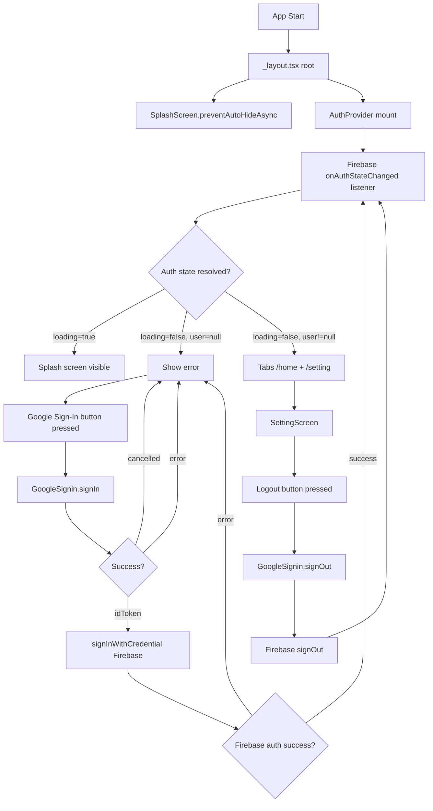

# Design Document

## Overview

Boilerplate ini mengintegrasikan Firebase Authentication dengan Google Sign-In ke dalam proyek Expo v56 yang sudah ada. Arsitektur berfokus pada tiga area utama:

1. **Inisialisasi & Splash Screen** — Firebase diinisialisasi sekali saat app dimuat, splash screen native dikontrol oleh `expo-splash-screen` dan disembunyikan setelah semua resource siap.
2. **Autentikasi** — Alur Google Sign-In menggunakan `@react-native-google-signin/google-signin` untuk mendapatkan `idToken`, lalu diverifikasi ke Firebase Authentication. State autentikasi dikelola oleh `AuthContext` yang mendistribusikan data `user` ke seluruh komponen.
3. **Navigasi Terproteksi** — Expo Router v56 `Stack.Protected` digunakan untuk melindungi rute berdasarkan state `user`. Tab navigasi (Home & Setting) menggunakan `NativeTabs` dari `expo-router/unstable-native-tabs`.

### Keputusan Desain Utama

- **Firebase JS SDK (modular)** dipilih daripada `@react-native-firebase` karena proyek sudah menggunakan Expo managed workflow dan tidak memerlukan native module tambahan selain `@react-native-google-signin/google-signin`. Firebase JS SDK v10+ bekerja dengan `AsyncStorage` untuk persistensi sesi.
- **`Stack.Protected`** (Expo Router v56) dipilih daripada pola `useSegments` + `router.replace` karena lebih deklaratif, lebih aman dari race condition, dan merupakan pendekatan resmi Expo Router SDK 53+.
- **`NativeTabs` dari `expo-router/unstable-native-tabs`** digunakan sesuai requirement untuk tab bar native (iOS UITabBar / Android Material BottomNavigation).
- **`expo-splash-screen`** dikontrol secara manual (`preventAutoHideAsync` + `hideAsync`) agar splash screen tetap tampil selama inisialisasi Firebase dan loading resource.

---

## Architecture

### Diagram Alur Aplikasi



### Diagram Struktur File

```
src/
├── app/
│   ├── _layout.tsx          # Root layout: AuthProvider + Stack.Protected
│   ├── login.tsx            # AuthScreen (Google Sign-In)
│   └── (tabs)/
│       ├── _layout.tsx      # NativeTabs layout (Home + Setting)
│       ├── index.tsx        # HomeScreen
│       └── setting.tsx      # SettingScreen (Logout)
├── components/
│   ├── app-tabs.tsx         # NativeTabs native (existing, dimodifikasi)
│   └── app-tabs.web.tsx     # Web tabs (existing, dimodifikasi)
├── context/
│   └── auth-context.tsx     # AuthContext + AuthProvider
├── lib/
│   └── firebase.ts          # Firebase init + auth export
└── constants/
    └── theme.ts             # (existing, tidak berubah)

.env                         # Firebase config (gitignored)
.env.example                 # Template konfigurasi
```

---

## Components and Interfaces

### 1. `lib/firebase.ts` — Firebase Initialization

Menginisialisasi Firebase app sekali menggunakan pola `getApps().length === 0`. Mengekspor instance `auth` untuk digunakan di seluruh aplikasi.

```typescript
// Pseudocode interface
function initializeFirebaseApp(): FirebaseApp
function getFirebaseAuth(): Auth
export const auth: Auth
```

**Konfigurasi dibaca dari:**
```
EXPO_PUBLIC_FIREBASE_API_KEY
EXPO_PUBLIC_FIREBASE_AUTH_DOMAIN
EXPO_PUBLIC_FIREBASE_PROJECT_ID
EXPO_PUBLIC_FIREBASE_STORAGE_BUCKET
EXPO_PUBLIC_FIREBASE_MESSAGING_SENDER_ID
EXPO_PUBLIC_FIREBASE_APP_ID
```

### 2. `context/auth-context.tsx` — AuthContext

```typescript
interface AuthUser {
  uid: string;
  email: string | null;
  displayName: string | null;
  photoURL: string | null;
}

interface AuthContextValue {
  user: AuthUser | null;
  loading: boolean;
  signInWithGoogle: () => Promise<void>;
  signOut: () => Promise<void>;
}

// Provider component
function AuthProvider({ children }: { children: ReactNode }): JSX.Element

// Hook
function useAuth(): AuthContextValue
```

**Lifecycle:**
- `mount`: Daftarkan `onAuthStateChanged` listener → set `user` dan `loading: false`
- `unmount`: Batalkan listener (unsubscribe)
- Timeout 10 detik: jika `loading` masih `true` setelah 10 detik, paksa `loading: false`, `user: null`

### 3. `app/_layout.tsx` — Root Layout

Menggunakan `Stack.Protected` dari Expo Router v56 untuk melindungi rute:

```typescript
// Pseudocode
<AuthProvider>
  <Stack>
    {/* Hanya tampil saat BELUM login */}
    <Stack.Protected guard={!isLoggedIn}>
      <Stack.Screen name="login" />
    </Stack.Protected>

    {/* Hanya tampil saat SUDAH login */}
    <Stack.Protected guard={isLoggedIn}>
      <Stack.Screen name="(tabs)" />
    </Stack.Protected>
  </Stack>
</AuthProvider>
```

Splash screen disembunyikan di sini setelah `loading === false`.

### 4. `app/login.tsx` — AuthScreen

- Menampilkan tombol "Sign in with Google" (menggunakan `GoogleSigninButton` atau tombol custom)
- Menampilkan `ActivityIndicator` saat `isSigningIn === true`
- Tombol dinonaktifkan saat loading
- Timeout 30 detik untuk reset loading state
- Menampilkan pesan error jika sign-in gagal

### 5. `app/(tabs)/_layout.tsx` — Tab Layout

Menggunakan `NativeTabs` dari `expo-router/unstable-native-tabs`:

```typescript
<NativeTabs>
  <NativeTabs.Trigger name="index">
    <NativeTabs.Trigger.Label>Home</NativeTabs.Trigger.Label>
    <NativeTabs.Trigger.Icon sf="house" md="home" />
  </NativeTabs.Trigger>

  <NativeTabs.Trigger name="setting">
    <NativeTabs.Trigger.Label>Setting</NativeTabs.Trigger.Label>
    <NativeTabs.Trigger.Icon sf="gearshape" md="settings" />
  </NativeTabs.Trigger>
</NativeTabs>
```

> Catatan: `NativeTabs.Trigger.Icon` mendukung prop `sf` untuk SF Symbol (iOS) dan `md` untuk Material icon (Android) melalui interface `SFSymbolIcon` dan `MaterialIcon`.

### 6. `app/(tabs)/index.tsx` — HomeScreen

- Menampilkan `user.displayName` atau `user.email` sebagai fallback
- Menampilkan foto profil dari `user.photoURL` menggunakan `expo-image`, atau avatar placeholder jika `null`

### 7. `app/(tabs)/setting.tsx` — SettingScreen

- Menampilkan tombol "Logout"
- Memanggil `signOut()` dari `AuthContext`
- Menampilkan `ActivityIndicator` saat proses logout berlangsung
- Tombol dinonaktifkan saat loading

---

## Data Models

### Firebase User (dari Firebase Auth SDK)

```typescript
// Dari firebase/auth User object
interface FirebaseUser {
  uid: string;
  email: string | null;
  displayName: string | null;
  photoURL: string | null;
  emailVerified: boolean;
  // ... field lainnya dari Firebase
}
```

### AuthContextValue

```typescript
interface AuthContextValue {
  user: {
    uid: string;
    email: string | null;
    displayName: string | null;
    photoURL: string | null;
  } | null;
  loading: boolean;
  signInWithGoogle: () => Promise<void>;
  signOut: () => Promise<void>;
}
```

### Firebase Config

```typescript
interface FirebaseConfig {
  apiKey: string;           // EXPO_PUBLIC_FIREBASE_API_KEY
  authDomain: string;       // EXPO_PUBLIC_FIREBASE_AUTH_DOMAIN
  projectId: string;        // EXPO_PUBLIC_FIREBASE_PROJECT_ID
  storageBucket: string;    // EXPO_PUBLIC_FIREBASE_STORAGE_BUCKET
  messagingSenderId: string; // EXPO_PUBLIC_FIREBASE_MESSAGING_SENDER_ID
  appId: string;            // EXPO_PUBLIC_FIREBASE_APP_ID
}
```

### Google Sign-In Response (dari `@react-native-google-signin/google-signin`)

```typescript
// Response dari GoogleSignin.signIn()
type SignInResponse =
  | { type: 'success'; data: { idToken: string; user: GoogleUser } }
  | { type: 'cancelled' }
  | { type: 'noSavedCredentialFound' };

interface GoogleUser {
  id: string;
  name: string | null;
  email: string;
  photo: string | null;
  familyName: string | null;
  givenName: string | null;
}
```

### Environment Variables

```
# .env.example
EXPO_PUBLIC_FIREBASE_API_KEY=your_api_key_here
EXPO_PUBLIC_FIREBASE_AUTH_DOMAIN=your_project.firebaseapp.com
EXPO_PUBLIC_FIREBASE_PROJECT_ID=your_project_id
EXPO_PUBLIC_FIREBASE_STORAGE_BUCKET=your_project.appspot.com
EXPO_PUBLIC_FIREBASE_MESSAGING_SENDER_ID=your_sender_id
EXPO_PUBLIC_FIREBASE_APP_ID=your_app_id
```

---

## Correctness Properties

*A property is a characteristic or behavior that should hold true across all valid executions of a system — essentially, a formal statement about what the system should do. Properties serve as the bridge between human-readable specifications and machine-verifiable correctness guarantees.*

### Property 1: Auth state listener cleanup

*For any* instance of `AuthProvider`, mounting then unmounting the component should result in the `onAuthStateChanged` listener being unsubscribed exactly once, leaving no active listeners after unmount.

**Validates: Requirements 3.1**

### Property 2: Auth-based routing

*For any* auth state (`user` is `null` or a valid user object), the router should always direct the user to the correct screen — unauthenticated users attempting to access HomeScreen or SettingScreen are redirected to AuthScreen, and authenticated users attempting to access AuthScreen are redirected to HomeScreen.

**Validates: Requirements 3.2, 3.3**

### Property 3: Logout always clears user state

*For any* authenticated user and any combination of errors from `GoogleSignin.signOut()` or Firebase `signOut()`, calling `signOut()` in `AuthContext` should always result in `user` becoming `null`, ensuring the local session is always cleared regardless of remote sign-out success or failure.

**Validates: Requirements 5.3, 5.5**

### Property 4: Firebase singleton initialization

*For any* number of calls to the Firebase initialization module (1 or more), the Firebase app should be initialized exactly once — `getApps().length` should always equal 1 after any number of initialization calls.

**Validates: Requirements 6.2**

### Property 5: User data display with fallback

*For any* authenticated user object with any combination of `displayName` (string or null), `email` (string or null), and `photoURL` (string or null), the HomeScreen should display `displayName` if non-null or `email` as fallback, and should render a profile image component when `photoURL` is non-null or a placeholder avatar when `photoURL` is null.

**Validates: Requirements 4.6, 4.7**

### Property 6: idToken forwarded to Firebase credential

*For any* successful Google Sign-In response containing a non-empty `idToken` string, the `signInWithGoogle` function should call `signInWithCredential` with a `GoogleAuthProvider` credential constructed from that exact `idToken`.

**Validates: Requirements 2.3**

### Property 7: Splash screen hides when loading completes

*For any* combination of resource loading outcomes (success or error) for fonts, assets, and Firebase auth state, `SplashScreen.hideAsync()` should always be called exactly once after `loading` transitions to `false`, ensuring the splash screen is never permanently visible.

**Validates: Requirements 1.2, 1.3**

---

## Error Handling

### Splash Screen Timeout
- Jika `loading` di `AuthContext` masih `true` setelah 10 detik, paksa `loading: false` dan `user: null`
- `SplashScreen.hideAsync()` dipanggil di `useEffect` yang memantau `loading === false`
- Selalu panggil `SplashScreen.hideAsync()` dalam blok `finally` untuk mencegah pengguna terjebak di splash screen

### Google Sign-In Errors
| Kondisi | Penanganan |
|---|---|
| User membatalkan (response.type === 'cancelled') | Kembali ke AuthScreen tanpa error message |
| `idToken` kosong/null | Tampilkan error "Authentication failed. Please try again." |
| `statusCodes.IN_PROGRESS` | Abaikan (sign-in sudah berjalan) |
| `statusCodes.PLAY_SERVICES_NOT_AVAILABLE` | Tampilkan error "Google Play Services not available" |
| Error jaringan | Tampilkan error "Network error. Please check your connection." |
| Timeout 30 detik | Reset `isSigningIn` ke `false`, tampilkan error timeout |

### Firebase Auth Errors
| Error Code | Pesan ke Pengguna |
|---|---|
| `auth/network-request-failed` | "Network error. Please check your connection." |
| `auth/invalid-credential` | "Invalid credentials. Please try again." |
| `auth/user-disabled` | "This account has been disabled." |
| Default | "Sign-in failed. Please try again." |

### Logout Errors
- Jika `GoogleSignin.signOut()` gagal: log error, lanjutkan ke `Firebase signOut()`
- Jika `Firebase signOut()` gagal: tampilkan alert dengan pesan error
- Dalam semua kasus: set `user: null` di `AuthContext` untuk memastikan sesi lokal dihapus, lalu navigasi ke AuthScreen

---

## Testing Strategy

### Penilaian PBT

Fitur ini adalah kombinasi dari:
- **Logika autentikasi** (state management, redirect logic) → **cocok untuk PBT**
- **UI rendering** (splash screen, tombol, foto profil) → **tidak cocok untuk PBT**
- **Integrasi Firebase/Google** (external services) → **tidak cocok untuk PBT, gunakan integration tests**
- **Inisialisasi Firebase** (singleton pattern) → **cocok untuk PBT**

Library PBT yang digunakan: **[fast-check](https://github.com/dubzzz/fast-check)** (TypeScript-native, tidak memerlukan setup tambahan).

### Unit Tests (Jest + React Testing Library)

Fokus pada logika yang dapat diisolasi:

1. **`lib/firebase.ts`**
   - Firebase diinisialisasi dengan 6 konfigurasi yang benar
   - Singleton: panggilan kedua mengembalikan instance yang sama
   - Mengekspor `auth` instance yang valid

2. **`context/auth-context.tsx`**
   - `onAuthStateChanged` listener didaftarkan saat mount
   - Listener dibatalkan saat unmount
   - `loading` berubah ke `false` setelah state auth resolved
   - Timeout 10 detik memaksa `loading: false` dan `user: null`
   - `signInWithGoogle` memanggil `GoogleSignin.configure`, `hasPlayServices`, `signIn`, dan `signInWithCredential` secara berurutan
   - `signOut` memanggil `GoogleSignin.signOut` lalu `Firebase signOut`
   - Error saat logout tetap mengeset `user: null`

3. **`app/_layout.tsx`**
   - `Stack.Protected` dengan `guard={false}` merender login screen
   - `Stack.Protected` dengan `guard={true}` merender tabs screen
   - `SplashScreen.hideAsync` dipanggil saat `loading === false`

4. **`app/login.tsx`**
   - Tombol dinonaktifkan saat `isSigningIn === true`
   - Error message ditampilkan saat sign-in gagal
   - Tidak ada error message saat user membatalkan

5. **`app/(tabs)/index.tsx`**
   - Menampilkan `displayName` jika tersedia
   - Menampilkan `email` sebagai fallback jika `displayName` null
   - Menampilkan avatar placeholder jika `photoURL` null

### Property-Based Tests (fast-check, minimum 100 iterasi per property)

Setiap property test harus diberi tag komentar:
`// Feature: expo-firebase-boilerplate, Property {N}: {property_text}`

**Property 1: Auth state listener cleanup**
- Generator: mock `onAuthStateChanged` yang dapat di-unsubscribe, berbagai siklus mount/unmount
- Verifikasi: setelah unmount, unsubscribe function dipanggil tepat sekali
- Tag: `Feature: expo-firebase-boilerplate, Property 1: Auth state listener cleanup`

**Property 2: Auth-based routing**
- Generator: berbagai kombinasi `user` (null atau valid object) dan route name (login, home, setting)
- Verifikasi: user=null selalu diarahkan ke login saat akses protected route; user!=null selalu diarahkan ke home saat akses login
- Tag: `Feature: expo-firebase-boilerplate, Property 2: Auth-based routing`

**Property 3: Logout always clears user state**
- Generator: berbagai `user` object yang valid, berbagai kombinasi error (throw/resolve) dari Google/Firebase signOut
- Verifikasi: setelah `signOut()` dipanggil, `user` selalu `null` terlepas dari error
- Tag: `Feature: expo-firebase-boilerplate, Property 3: Logout always clears user state`

**Property 4: Firebase singleton initialization**
- Generator: berbagai jumlah panggilan inisialisasi (1 hingga N)
- Verifikasi: `getApps().length` selalu 1 setelah satu atau lebih panggilan inisialisasi
- Tag: `Feature: expo-firebase-boilerplate, Property 4: Firebase singleton initialization`

**Property 5: User data display with fallback**
- Generator: `user` object dengan kombinasi `displayName` (string/null), `email` (string/null), `photoURL` (string/null)
- Verifikasi: teks yang dirender adalah `displayName` jika non-null atau `email` sebagai fallback; komponen image/placeholder sesuai dengan `photoURL`
- Tag: `Feature: expo-firebase-boilerplate, Property 5: User data display with fallback`

**Property 6: idToken forwarded to Firebase credential**
- Generator: berbagai non-empty idToken string
- Verifikasi: `signInWithCredential` selalu dipanggil dengan `GoogleAuthProvider.credential(idToken)` yang sesuai
- Tag: `Feature: expo-firebase-boilerplate, Property 6: idToken forwarded to Firebase credential`

**Property 7: Splash screen hides when loading completes**
- Generator: berbagai kombinasi outcome loading (success/error) untuk fonts, assets, dan Firebase auth
- Verifikasi: `SplashScreen.hideAsync` dipanggil tepat sekali setelah `loading` menjadi `false`
- Tag: `Feature: expo-firebase-boilerplate, Property 7: Splash screen hides when loading completes`

### Integration Tests

Dijalankan dengan development build (bukan Expo Go):

1. **Google Sign-In flow end-to-end** — Verifikasi bahwa `GoogleSignin.configure` dipanggil dengan `webClientId` yang valid sebelum `signIn()`
2. **Firebase Auth persistence** — Verifikasi bahwa `onAuthStateChanged` mengembalikan user yang sama setelah app restart (menggunakan `AsyncStorage` persistence)
3. **Splash screen timing** — Verifikasi bahwa `SplashScreen.hideAsync` dipanggil setelah `loading === false`

### Catatan Implementasi

- `@react-native-google-signin/google-signin` **tidak dapat digunakan di Expo Go** — wajib menggunakan development build
- Firebase JS SDK memerlukan `AsyncStorage` untuk persistensi sesi di React Native: install `@react-native-async-storage/async-storage` dan gunakan `initializeAuth` dengan `getReactNativePersistence`
- `app.json` perlu ditambahkan: plugin `@react-native-google-signin/google-signin`, `android.googleServicesFile`, dan `ios.googleServicesFile`
