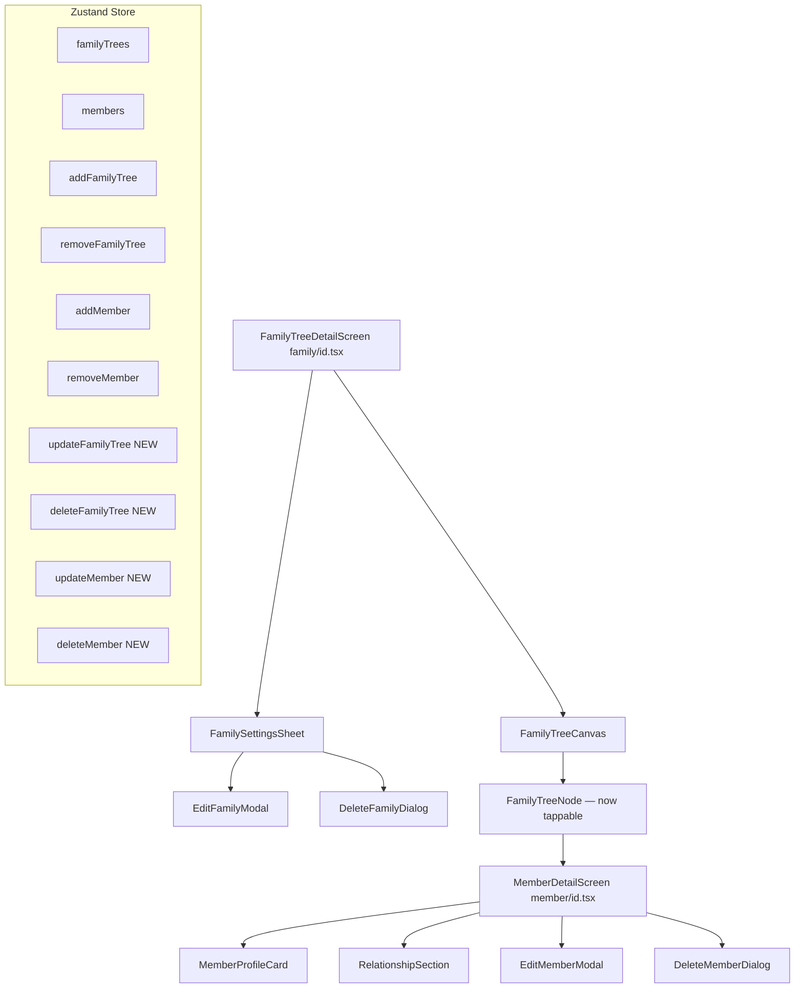
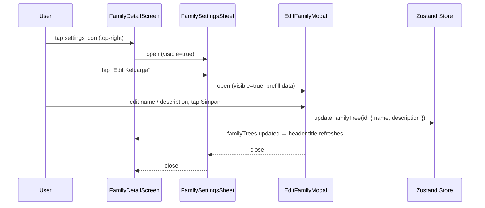
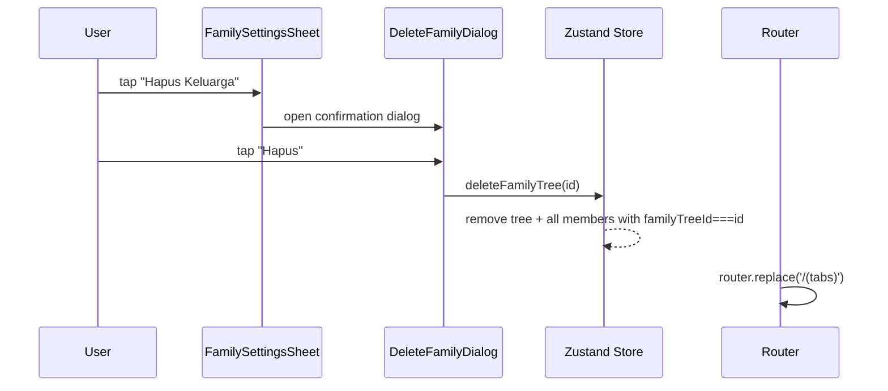
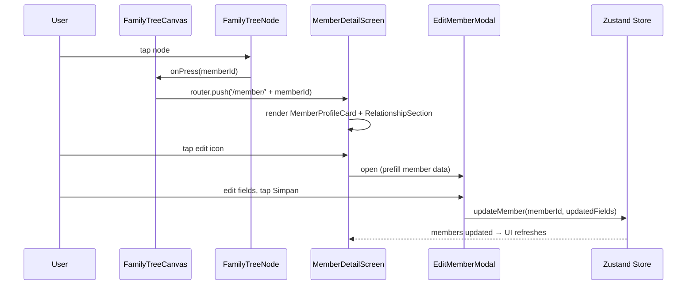
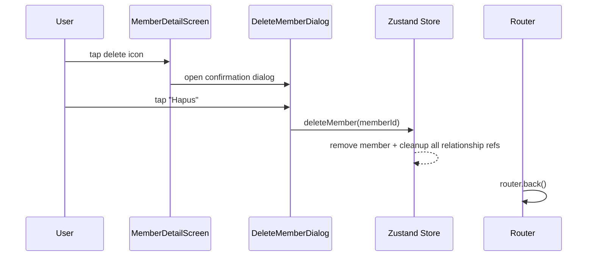

# Design Document: AsalUsul Step 5 — Family & Member Management

## Overview

Step 5 extends the AsalUsul app with full CRUD management for both family trees and
individual members. It introduces a settings bottom sheet on the Family Detail screen,
edit/delete flows for families, a dedicated Member Detail page, and edit/delete flows
for members — all backed by an extended Zustand store with no Firebase dependency.

The design philosophy continues the established **calm minimalism with cultural warmth**:
beige surfaces, dark forest-green accents, rounded cards, elegant typography, and
Reanimated-powered animations throughout.

---

## Architecture

### High-Level Component Hierarchy



### Routing Changes

```
src/app/
  family/
    [id].tsx          ← updated: adds header settings button + FamilySettingsSheet
  member/
    [id].tsx          ← NEW: MemberDetailScreen
```

### New Component Files

```
src/components/
  family/
    FamilySettingsSheet.tsx   ← bottom sheet: Edit / Delete options
    EditFamilyModal.tsx       ← modal form: name + description
    DeleteFamilyDialog.tsx    ← confirmation dialog
  member/
    MemberProfileCard.tsx     ← profile header card (avatar, name, role, birth)
    RelationshipSection.tsx   ← Ayah / Ibu / Pasangan / Anak summary
    EditMemberModal.tsx       ← modal form: all member fields
    DeleteMemberDialog.tsx    ← confirmation dialog
```

---

## Sequence Diagrams

### Edit Family Flow



### Delete Family Flow



### Member Detail & Edit Flow



### Delete Member Flow



---

## Data Models

### Extended `FamilyTreeStore` Interface

```typescript
// src/types/familyTree.ts — additions

interface FamilyTreeActions {
  // Existing
  addFamilyTree: (name: string, ownerId: string) => void;
  removeFamilyTree: (id: string) => void;
  addMember: (member: Omit<Member, 'id' | 'createdAt'>) => void;
  removeMember: (memberId: string) => void;

  // NEW — Step 5
  updateFamilyTree: (id: string, patch: Partial<Pick<FamilyTree, 'name' | 'description'>>) => void;
  deleteFamilyTree: (id: string) => void;
  updateMember: (memberId: string, patch: Partial<Omit<Member, 'id' | 'familyTreeId' | 'createdAt'>>) => void;
  deleteMember: (memberId: string) => void;
}
```

### `EditFamilyFormValues`

```typescript
interface EditFamilyFormValues {
  name: string;       // required, min 1 char after trim
  description: string; // optional, empty string = null in store
}

interface EditFamilyFormErrors {
  name?: string;
}
```

### `EditMemberFormValues`

```typescript
interface EditMemberFormValues {
  fullName: string;           // required
  gender: 'male' | 'female';  // required
  role: string;               // required
  birthDate: string;          // optional, YYYY-MM-DD or empty
  bio: string;                // optional
}

interface EditMemberFormErrors {
  fullName?: string;
  gender?: string;
  role?: string;
  birthDate?: string;
}
```

---

## Components and Interfaces

### 1. `FamilySettingsSheet` — `components/family/FamilySettingsSheet.tsx`

**Purpose**: Premium bottom sheet triggered from the Family Detail header. Presents
"Edit Keluarga" and "Hapus Keluarga" actions.

**Interface**:
```typescript
interface FamilySettingsSheetProps {
  visible: boolean;
  onClose: () => void;
  onEditPress: () => void;
  onDeletePress: () => void;
}
```

**Behavior**:
- Animated slide-up from bottom using `SlideInDown` / `SlideOutDown` (Reanimated)
- Dark semi-transparent overlay (`rgba(0,0,0,0.45)`) behind the sheet
- Sheet has `borderTopLeftRadius: Radii.lg`, `borderTopRightRadius: Radii.lg`
- Two action rows: icon + label, separated by a subtle divider
- "Hapus Keluarga" row uses a danger red tint (`#C0392B`)
- Tapping overlay closes the sheet

**Layout**:
```
┌─────────────────────────────────┐
│  ████ drag handle ████          │
│                                 │
│  ✏️  Edit Keluarga              │
│  ─────────────────────────────  │
│  🗑️  Hapus Keluarga  (red)      │
│                                 │
│  [Batal]                        │
└─────────────────────────────────┘
```

---

### 2. `EditFamilyModal` — `components/family/EditFamilyModal.tsx`

**Purpose**: Full-screen modal (or large bottom sheet) for editing family name and description.

**Interface**:
```typescript
interface EditFamilyModalProps {
  visible: boolean;
  initialName: string;
  initialDescription: string | null;
  onSave: (name: string, description: string | null) => void;
  onClose: () => void;
}
```

**Behavior**:
- Pre-fills inputs with `initialName` and `initialDescription`
- Validates: name must not be empty after trim
- On save: calls `onSave(trimmedName, description || null)` then closes
- `KeyboardAvoidingView` for iOS/Android keyboard handling
- Animated entrance: `SlideInDown.duration(350).springify()`

---

### 3. `DeleteFamilyDialog` — `components/family/DeleteFamilyDialog.tsx`

**Purpose**: Confirmation dialog before permanently deleting a family tree.

**Interface**:
```typescript
interface DeleteFamilyDialogProps {
  visible: boolean;
  familyName: string;
  onConfirm: () => void;
  onCancel: () => void;
}
```

**Behavior**:
- Modal overlay with centered card
- Copy: "Apakah Anda yakin ingin menghapus pohon keluarga **{familyName}**?"
- Sub-copy: "Semua anggota keluarga akan ikut terhapus."
- Two buttons: "Batal" (outline) and "Hapus" (filled, danger red)
- Animated entrance: `ZoomIn.duration(250)`

---

### 4. `MemberDetailScreen` — `app/member/[id].tsx`

**Purpose**: Full profile page for a single family member.

**Interface**: Expo Router dynamic route — reads `id` from `useLocalSearchParams`.

**Sections**:
1. **Header** — back button (left), edit icon + delete icon (right)
2. **MemberProfileCard** — avatar initials, full name, role badge, birth date
3. **Bio section** — collapsible text block (if bio exists)
4. **RelationshipSection** — Ayah, Ibu, Pasangan, Anak rows

**Layout**:
```
┌─────────────────────────────────┐
│  ← Back          ✏️  🗑️         │  ← Stack header
│                                 │
│  ┌─────────────────────────┐    │
│  │   [Avatar 80px]         │    │
│  │   Joko Widodo           │    │
│  │   Ayah  •  1961         │    │
│  └─────────────────────────┘    │
│                                 │
│  ┌─────────────────────────┐    │
│  │  Biografi               │    │
│  │  Presiden ke-7 RI...    │    │
│  └─────────────────────────┘    │
│                                 │
│  ┌─────────────────────────┐    │
│  │  Hubungan Keluarga      │    │
│  │  Ayah:    Widjiatno     │    │
│  │  Ibu:     Sujiatmi      │    │
│  │  Pasangan: Iriana       │    │
│  │  Anak:    Gibran, ...   │    │
│  └─────────────────────────┘    │
└─────────────────────────────────┘
```

---

### 5. `MemberProfileCard` — `components/member/MemberProfileCard.tsx`

**Purpose**: Hero card at the top of MemberDetailScreen.

**Interface**:
```typescript
interface MemberProfileCardProps {
  member: Member;
}
```

**Behavior**:
- Large circular avatar (80px) with initials, `AsalUsulColors.primary` background
- Full name in heading style
- Role badge: pill chip with `AsalUsulColors.backgroundOverlay` background
- Birth date formatted as "DD MMMM YYYY" (or "Tidak diketahui" if null)
- Gender icon: ♂ / ♀ in `AsalUsulColors.primaryMuted`
- `FadeInDown` entering animation

---

### 6. `RelationshipSection` — `components/member/RelationshipSection.tsx`

**Purpose**: Displays resolved relationship names for a member.

**Interface**:
```typescript
interface RelationshipSectionProps {
  member: Member;
  allMembers: Member[];
}
```

**Behavior**:
- Resolves `fatherId`, `motherId`, `spouseIds`, `childrenIds` to full names
- Each row: label (Ayah / Ibu / Pasangan / Anak) + resolved name(s) or "—"
- Multiple spouses / children shown as comma-separated names
- Tapping a name navigates to that member's detail page
- Empty relationships show "—" gracefully (no crash)

---

### 7. `EditMemberModal` — `components/member/EditMemberModal.tsx`

**Purpose**: Full-screen modal for editing all editable member fields.

**Interface**:
```typescript
interface EditMemberModalProps {
  visible: boolean;
  member: Member;
  onSave: (patch: Partial<Omit<Member, 'id' | 'familyTreeId' | 'createdAt'>>) => void;
  onClose: () => void;
}
```

**Behavior**:
- Pre-fills all fields from `member`
- Reuses the same field components and validation logic as `FamilyMemberForm`
- Does NOT allow editing relationship fields (fatherId, motherId, spouseIds, childrenIds)
  — relationship editing is a future feature
- On save: calls `onSave(patch)` with only changed fields, then closes
- `KeyboardAvoidingView` + `ScrollView`

---

### 8. `DeleteMemberDialog` — `components/member/DeleteMemberDialog.tsx`

**Purpose**: Confirmation dialog before permanently deleting a member.

**Interface**:
```typescript
interface DeleteMemberDialogProps {
  visible: boolean;
  memberName: string;
  onConfirm: () => void;
  onCancel: () => void;
}
```

**Behavior**:
- Copy: "Apakah Anda yakin ingin menghapus **{memberName}** dari pohon keluarga?"
- Sub-copy: "Semua referensi hubungan akan ikut dihapus."
- Two buttons: "Batal" (outline) and "Hapus" (filled, danger red)
- Animated entrance: `ZoomIn.duration(250)`

---

## Algorithmic Pseudocode

### `updateFamilyTree` Store Action

```pascal
PROCEDURE updateFamilyTree(id, patch)
  INPUT: id: string, patch: { name?, description? }
  OUTPUT: side-effect — updates familyTrees in Zustand state

  PRECONDITIONS:
    - patch.name, if provided, must be non-empty after trim
    - id must reference an existing FamilyTree

  BEGIN
    now ← new Date().toISOString()
    set(state =>
      familyTrees: state.familyTrees.map(tree =>
        IF tree.id === id THEN
          RETURN { ...tree, ...patch, updatedAt: now }
        ELSE
          RETURN tree
        END IF
      )
    )
  END

  POSTCONDITIONS:
    - Exactly one tree with matching id has name/description updated
    - updatedAt is refreshed to current timestamp
    - All other trees are unchanged
```

### `deleteFamilyTree` Store Action

```pascal
PROCEDURE deleteFamilyTree(id)
  INPUT: id: string
  OUTPUT: side-effect — removes tree and all its members

  PRECONDITIONS:
    - id may or may not exist (idempotent)

  BEGIN
    set(state =>
      familyTrees: state.familyTrees.filter(t => t.id !== id)
      members:     state.members.filter(m => m.familyTreeId !== id)
    )
  END

  POSTCONDITIONS:
    - No FamilyTree with matching id remains in state
    - No Member with familyTreeId === id remains in state
    - All other trees and members are unchanged
```

### `updateMember` Store Action

```pascal
PROCEDURE updateMember(memberId, patch)
  INPUT: memberId: string, patch: Partial<Member fields>
  OUTPUT: side-effect — updates member in Zustand state

  PRECONDITIONS:
    - patch.fullName, if provided, must be non-empty after trim
    - memberId must reference an existing Member

  BEGIN
    now ← new Date().toISOString()
    set(state =>
      members: state.members.map(m =>
        IF m.id === memberId THEN
          RETURN { ...m, ...patch }
        ELSE
          RETURN m
        END IF
      )
      familyTrees: state.familyTrees.map(tree =>
        IF tree.id === target.familyTreeId THEN
          RETURN { ...tree, updatedAt: now }
        ELSE
          RETURN tree
        END IF
      )
    )
  END

  POSTCONDITIONS:
    - Exactly one member with matching id has fields updated
    - Parent tree's updatedAt is refreshed
    - Relationship fields (fatherId, motherId, spouseIds, childrenIds) are
      only updated if explicitly included in patch
```

### `deleteMember` Store Action

```pascal
PROCEDURE deleteMember(memberId)
  INPUT: memberId: string
  OUTPUT: side-effect — removes member and cleans up all relationship refs

  PRECONDITIONS:
    - memberId may or may not exist (idempotent — delegates to removeMember)

  BEGIN
    // Delegates to existing removeMember which already handles:
    //   - filter out the member
    //   - remove memberId from all spouseIds arrays
    //   - remove memberId from all childrenIds arrays
    //   - set fatherId = null where fatherId === memberId
    //   - set motherId = null where motherId === memberId
    //   - decrement tree.totalMembers
    CALL removeMember(memberId)
  END

  NOTE: deleteMember is an alias for removeMember, exposed under the new
  naming convention for Step 5 API consistency. Both names are kept in the
  store to avoid breaking existing callers.
```

### Relationship Resolution (for `RelationshipSection`)

```pascal
FUNCTION resolveRelationships(member, allMembers)
  INPUT: member: Member, allMembers: Member[]
  OUTPUT: { father, mother, spouses, children }

  BEGIN
    memberMap ← Map(allMembers.map(m => [m.id, m]))

    father   ← member.fatherId  ? memberMap.get(member.fatherId)  : null
    mother   ← member.motherId  ? memberMap.get(member.motherId)  : null
    spouses  ← member.spouseIds.map(id => memberMap.get(id)).filter(Boolean)
    children ← member.childrenIds.map(id => memberMap.get(id)).filter(Boolean)

    RETURN { father, mother, spouses, children }
  END

  POSTCONDITIONS:
    - Stale IDs (member deleted but ref not cleaned) are silently filtered out
    - Result is always a valid object (never throws)
```

---

## Key Function Signatures

### Store — `useFamilyTreeStore.ts`

```typescript
// New actions added to the store
updateFamilyTree(
  id: string,
  patch: Partial<Pick<FamilyTree, 'name' | 'description'>>
): void

deleteFamilyTree(id: string): void

updateMember(
  memberId: string,
  patch: Partial<Omit<Member, 'id' | 'familyTreeId' | 'createdAt'>>
): void

deleteMember(memberId: string): void
```

### Validation Utilities

```typescript
// Reused from FamilyMemberForm, exported for EditMemberModal
export function validateMemberForm(values: EditMemberFormValues): EditMemberFormErrors

// New for EditFamilyModal
export function validateFamilyForm(values: EditFamilyFormValues): EditFamilyFormErrors
```

### Relationship Resolver

```typescript
// src/utils/familyTreeUtils.ts — new export
export function resolveRelationships(
  member: Member,
  allMembers: Member[]
): {
  father: Member | null;
  mother: Member | null;
  spouses: Member[];
  children: Member[];
}
```

### `FamilyTreeNode` — updated `onPress` wiring

```typescript
// FamilyTreeCanvas passes handler down
<FamilyTreeNode
  member={node.member}
  onPress={(memberId) => router.push(`/member/${memberId}`)}
/>
```

---

## Screen Layouts

### Family Detail Screen — Updated Header

```
┌─────────────────────────────────┐
│  ← Joko Widodo          ⚙️      │  ← Stack header with settings icon
│─────────────────────────────────│
│                                 │
│  [FamilyTreeCanvas]             │
│                                 │
│                        [+ FAB]  │
└─────────────────────────────────┘
```

### Member Detail Screen

```
┌─────────────────────────────────┐
│  ← Kembali          ✏️  🗑️      │
│─────────────────────────────────│
│  ┌─────────────────────────┐    │
│  │  [Avatar 80px]  ♂       │    │
│  │  Joko Widodo            │    │
│  │  [Ayah]  •  21 Jun 1961 │    │
│  └─────────────────────────┘    │
│                                 │
│  ┌─────────────────────────┐    │
│  │  Biografi               │    │
│  │  Presiden ke-7 RI...    │    │
│  └─────────────────────────┘    │
│                                 │
│  ┌─────────────────────────┐    │
│  │  Hubungan Keluarga      │    │
│  │  Ayah     Widjiatno  →  │    │
│  │  Ibu      Sujiatmi   →  │    │
│  │  Pasangan Iriana     →  │    │
│  │  Anak     Gibran, …  →  │    │
│  └─────────────────────────┘    │
└─────────────────────────────────┘
```

---

## Animation Specifications

| Interaction | Animation | Duration | Library |
|---|---|---|---|
| FamilySettingsSheet open | `SlideInDown.springify()` | ~350ms | Reanimated |
| FamilySettingsSheet close | `SlideOutDown.duration(250)` | 250ms | Reanimated |
| EditFamilyModal open | `SlideInDown.duration(350).springify()` | ~350ms | Reanimated |
| DeleteFamilyDialog appear | `ZoomIn.duration(250)` | 250ms | Reanimated |
| DeleteMemberDialog appear | `ZoomIn.duration(250)` | 250ms | Reanimated |
| MemberDetailScreen enter | `FadeIn.duration(300)` | 300ms | Reanimated |
| MemberProfileCard enter | `FadeInDown.duration(400).delay(100)` | 400ms | Reanimated |
| RelationshipSection enter | `FadeInDown.duration(400).delay(200)` | 400ms | Reanimated |
| Node press feedback | `withSpring(0.95)` → `withSpring(1)` | spring | Reanimated |
| Edit/Delete icon press | `withSpring(0.9)` → `withSpring(1)` | spring | Reanimated |

---

## Error Handling

### Scenario 1: Member not found in store

**Condition**: `app/member/[id].tsx` receives an `id` that no longer exists in the store
(e.g., member was deleted from another screen).
**Response**: `useEffect` guard detects `!member` and calls `router.back()`.
**Recovery**: Automatic — user is returned to the previous screen.

### Scenario 2: Family tree not found after deletion

**Condition**: `app/family/[id].tsx` detects `!tree` after `deleteFamilyTree` is called.
**Response**: Existing `useEffect` guard fires `router.back()` — now updated to use
`router.replace('/(tabs)')` to avoid navigating back into a deleted tree.
**Recovery**: Automatic — user lands on the Home tab.

### Scenario 3: Stale relationship IDs

**Condition**: A member's `fatherId` references a deleted member.
**Response**: `resolveRelationships` silently filters out `undefined` results from the
member map lookup. The UI shows "—" for that relationship row.
**Recovery**: Graceful degradation — no crash, no error state shown.

### Scenario 4: Empty family name on save

**Condition**: User clears the name field in `EditFamilyModal` and taps Simpan.
**Response**: `validateFamilyForm` returns `{ name: 'Nama keluarga wajib diisi' }`.
Inline error appears below the input. Store is not updated.
**Recovery**: User corrects the input and retries.

---

## Testing Strategy

### Unit Tests

- `validateFamilyForm`: empty name → error; non-empty → no error
- `validateMemberForm`: same rules as existing `validateForm` in `FamilyMemberForm`
- `resolveRelationships`: stale IDs filtered; all four relationship types resolved correctly
- `updateFamilyTree` store action: patch applied; updatedAt refreshed; other trees unchanged
- `deleteFamilyTree` store action: tree removed; all members with matching familyTreeId removed
- `updateMember` store action: patch applied; tree updatedAt refreshed; other members unchanged
- `deleteMember` store action: delegates to `removeMember`; all relationship refs cleaned up

### Property-Based Tests (fast-check)

See Correctness Properties section below.

### Integration Tests

- `MemberDetailScreen`: renders profile card and relationship section for a known member
- `FamilySettingsSheet`: opens on settings icon press; calls correct callbacks
- `EditFamilyModal`: pre-fills data; validates; calls `onSave` with correct args
- `DeleteFamilyDialog`: calls `onConfirm` on "Hapus"; calls `onCancel` on "Batal"

---

## Correctness Properties

### Property 1: `updateFamilyTree` idempotency on unknown id

**Validates: Requirements 2.1, 2.2**

*For any* id that does not exist in `familyTrees`, calling `updateFamilyTree(id, patch)`
leaves the state unchanged.

```typescript
fc.assert(
  fc.property(fc.string(), fc.record({ name: fc.string({ minLength: 1 }) }), (unknownId, patch) => {
    const before = useFamilyTreeStore.getState().familyTrees;
    useFamilyTreeStore.getState().updateFamilyTree(unknownId, patch);
    const after = useFamilyTreeStore.getState().familyTrees;
    expect(after).toEqual(before);
  })
);
```

### Property 2: `deleteFamilyTree` removes all members of that tree

**Validates: Requirements 3.1, 3.2, 3.3**

*For any* valid family tree id, after `deleteFamilyTree(id)` no member with
`familyTreeId === id` remains in the store.

```typescript
fc.assert(
  fc.property(fc.constantFrom(...treeIds), (id) => {
    useFamilyTreeStore.getState().deleteFamilyTree(id);
    const remaining = useFamilyTreeStore.getState().members.filter(
      (m) => m.familyTreeId === id
    );
    expect(remaining).toHaveLength(0);
  })
);
```

### Property 3: `deleteMember` cleans up all relationship references

**Validates: Requirements 6.1, 6.2, 6.3, 6.4**

*For any* valid member id, after `deleteMember(id)` no other member in the store
references that id in `fatherId`, `motherId`, `spouseIds`, or `childrenIds`.

```typescript
fc.assert(
  fc.property(fc.constantFrom(...memberIds), (id) => {
    useFamilyTreeStore.getState().deleteMember(id);
    const members = useFamilyTreeStore.getState().members;
    for (const m of members) {
      expect(m.fatherId).not.toBe(id);
      expect(m.motherId).not.toBe(id);
      expect(m.spouseIds).not.toContain(id);
      expect(m.childrenIds).not.toContain(id);
    }
  })
);
```

### Property 4: `updateMember` never changes id, familyTreeId, or createdAt

**Validates: Requirements 5.1, 5.2**

*For any* valid member id and any patch object, `updateMember` never mutates
`id`, `familyTreeId`, or `createdAt` of the target member.

```typescript
fc.assert(
  fc.property(
    fc.constantFrom(...memberIds),
    fc.record({ fullName: fc.string({ minLength: 1 }) }),
    (id, patch) => {
      const before = useFamilyTreeStore.getState().members.find((m) => m.id === id)!;
      useFamilyTreeStore.getState().updateMember(id, patch);
      const after = useFamilyTreeStore.getState().members.find((m) => m.id === id)!;
      expect(after.id).toBe(before.id);
      expect(after.familyTreeId).toBe(before.familyTreeId);
      expect(after.createdAt).toBe(before.createdAt);
    }
  )
);
```

### Property 5: `resolveRelationships` never throws for any member

**Validates: Requirements 4.1, 4.2**

*For any* member and any array of members (including empty), `resolveRelationships`
returns a valid object without throwing.

```typescript
fc.assert(
  fc.property(
    fc.record({
      id: fc.string(),
      fatherId: fc.option(fc.string()),
      motherId: fc.option(fc.string()),
      spouseIds: fc.array(fc.string()),
      childrenIds: fc.array(fc.string()),
    }),
    fc.array(fc.record({ id: fc.string() })),
    (member, allMembers) => {
      expect(() => resolveRelationships(member as Member, allMembers as Member[])).not.toThrow();
    }
  )
);
```

### Property 6: `validateFamilyForm` — empty name always produces an error

**Validates: Requirements 2.3, 5.3**

*For any* string that is empty or whitespace-only, `validateFamilyForm` returns
a non-empty errors object with a `name` key.

```typescript
fc.assert(
  fc.property(fc.stringMatching(/^\s*$/), (emptyName) => {
    const errors = validateFamilyForm({ name: emptyName, description: '' });
    expect(errors.name).toBeDefined();
  })
);
```

### Property 7: `validateFamilyForm` — non-empty name produces no name error

**Validates: Requirements 2.3, 5.3**

*For any* string with at least one non-whitespace character, `validateFamilyForm`
returns an errors object without a `name` key.

```typescript
fc.assert(
  fc.property(fc.string({ minLength: 1 }).filter((s) => s.trim().length > 0), (name) => {
    const errors = validateFamilyForm({ name, description: '' });
    expect(errors.name).toBeUndefined();
  })
);
```

---

## Dependencies

All required packages are already installed. No new dependencies needed.

| Package | Version | Usage |
|---|---|---|
| `react-native-reanimated` | 4.3.1 | Bottom sheet, modal, card animations |
| `zustand` | ^5.0.13 | Extended store actions |
| `expo-router` | ~56.2.6 | `app/member/[id].tsx` dynamic route |
| `@expo/vector-icons` | ^15.0.2 | Settings, edit, delete icons |
| `react-native-safe-area-context` | ~5.7.0 | SafeAreaView in new screens |
| `fast-check` | ^4.8.0 | Property-based tests |

---

## Future Scalability Notes

- **Firebase sync**: `updateFamilyTree`, `deleteFamilyTree`, `updateMember`, `deleteMember`
  are designed as thin wrappers — adding a Firestore write alongside the Zustand mutation
  requires only a one-line addition per action.
- **Relationship editing**: `EditMemberModal` intentionally omits relationship fields.
  A dedicated `EditRelationshipsModal` can be added in Step 6 without touching the
  existing edit flow.
- **Media uploads**: `MemberProfileCard` renders an initials avatar with a placeholder
  tap target. Swapping in `expo-image` with a real `photoUrl` requires only a conditional
  render change in `MemberProfileCard`.
- **Large trees**: `RelationshipSection` renders children as a flat list. For trees with
  10+ children, a `FlatList` with `horizontal` scroll can replace the current `View` map
  without changing the data model.
- **Multi-user collaboration**: The `ownerId` field on `FamilyTree` is already present.
  Adding a `collaboratorIds` array to `FamilyTree` and a permission check in each store
  action is the only change needed.
