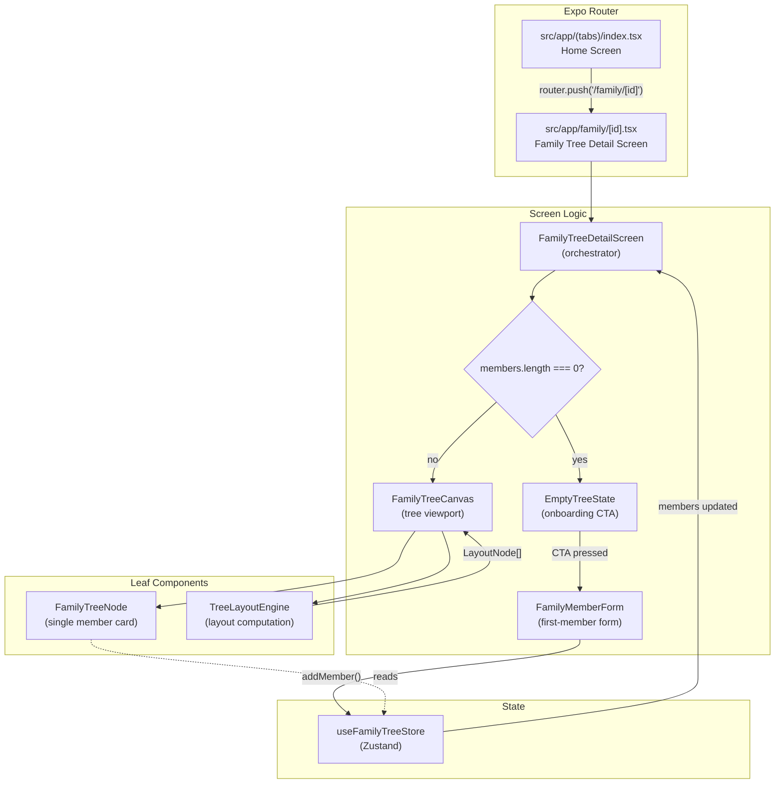
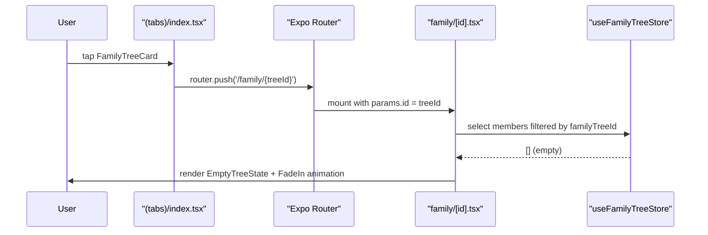
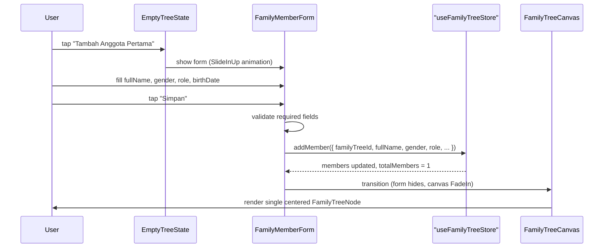

# Design Document: Family Tree Detail (STEP 4)

## Overview

This feature implements the Family Tree Detail Page for the AsalUsul mobile app — the screen users land on after tapping a family tree card from the Home list. It covers three distinct states: an empty-tree onboarding experience that prompts the user to add themselves as the first member, a form for capturing that first member's identity, and a minimal tree canvas that renders the first node once the member is saved. All state is local (Zustand only); no Firebase integration is included in this step.

The design is intentionally layered for future scalability: a `TreeLayoutEngine` abstraction separates layout computation from rendering, `FamilyTreeCanvas` owns the viewport, and `FamilyTreeNode` is a pure presentational card — making it straightforward to add multi-generation trees, pan/zoom, SVG relationship lines, and remote persistence in later steps.

---

## Architecture



---

## Sequence Diagrams

### Flow A — Navigate to Empty Tree



### Flow B — Submit First Member



---

## Components and Interfaces

### `src/app/family/[id].tsx` — Detail Screen

**Purpose**: Expo Router dynamic route. Reads `id` from `useLocalSearchParams`, selects the matching `FamilyTree` and its `Member[]` from the store, and delegates rendering to child components.

**Responsibilities**:
- Resolve `treeId` via `useLocalSearchParams<{ id: string }>()`
- Guard against unknown tree IDs (redirect back if not found)
- Select `treeMembers = members.filter(m => m.familyTreeId === treeId)`
- Render `EmptyTreeState` when `treeMembers.length === 0`
- Render `FamilyTreeCanvas` when `treeMembers.length > 0`
- Manage `showForm: boolean` local state to toggle `FamilyMemberForm`
- Configure `Stack.Screen` title to the tree's name

**Interface**:
```typescript
// No exported props — this is a route file
// Internal state:
type DetailScreenState = {
  showForm: boolean;
};
```

---

### `src/components/family/EmptyTreeState.tsx`

**Purpose**: Emotional onboarding screen shown when a family tree has no members yet.

**Responsibilities**:
- Display illustration placeholder (SVG/icon-based)
- Display heading and explanatory copy in Indonesian
- Render a CTA button that triggers the form

**Interface**:
```typescript
export interface EmptyTreeStateProps {
  /** Called when the user taps the "Tambah Anggota Pertama" CTA */
  onAddFirstMember: () => void;
}
```

---

### `src/components/family/FamilyMemberForm.tsx`

**Purpose**: Animated form for capturing the first family member's identity. Appears with a `SlideInDown` + `FadeIn` animation.

**Responsibilities**:
- Render controlled inputs for all required and optional fields
- Perform inline validation on submit (not on every keystroke)
- Call `addMember` on the Zustand store on valid submit
- Call `onSuccess` callback after store update
- Handle keyboard avoidance via `KeyboardAvoidingView`

**Interface**:
```typescript
export interface FamilyMemberFormProps {
  /** The family tree this member belongs to */
  familyTreeId: string;
  /** Called after the member is successfully added to the store */
  onSuccess: () => void;
  /** Called when the user dismisses the form without submitting */
  onDismiss: () => void;
}

// Internal form state shape:
type FormValues = {
  fullName: string;
  gender: 'male' | 'female' | null;
  role: string;           // 'Anak' | 'Ayah' | 'Ibu' | 'Kakek' | 'Nenek'
  birthDate: string;      // 'YYYY-MM-DD' or ''
  bio: string;
};

type FormErrors = {
  fullName?: string;
  gender?: string;
  role?: string;
};
```

---

### `src/components/family/FamilyTreeCanvas.tsx`

**Purpose**: Viewport/container for the family tree visualization. Delegates layout computation to `TreeLayoutEngine` and renders `FamilyTreeNode` components at computed positions.

**Responsibilities**:
- Accept a flat `Member[]` array
- Call `TreeLayoutEngine.computeLayout(members)` to get `LayoutNode[]`
- Render each `LayoutNode` as a `FamilyTreeNode` at the correct position
- For the initial single-node case: center the node in the available space
- Prepare for future: `ScrollView` with `contentContainerStyle` for pan/zoom

**Interface**:
```typescript
export interface FamilyTreeCanvasProps {
  /** All members belonging to this family tree */
  members: Member[];
  /** Called when a node is tapped (future: open member detail) */
  onNodePress?: (memberId: string) => void;
}
```

---

### `src/components/family/FamilyTreeNode.tsx`

**Purpose**: Pure presentational card for a single family member in the tree.

**Responsibilities**:
- Display circular avatar placeholder (initials-based)
- Display full name, role label, and birth year
- Apply `FadeIn` + `ZoomIn` entering animation
- Apply scale press feedback via `Animated.View` + `useSharedValue`

**Interface**:
```typescript
export interface FamilyTreeNodeProps {
  member: Member;
  onPress?: (memberId: string) => void;
}
```

---

### `src/utils/treeLayoutEngine.ts` — TreeLayoutEngine

**Purpose**: Pure utility module that computes display positions for tree nodes. Decoupled from React so it can be unit-tested independently and swapped for a more sophisticated algorithm later.

**Interface**:
```typescript
export interface LayoutNode {
  member: Member;
  x: number;   // center X in logical pixels
  y: number;   // center Y in logical pixels
}

export interface TreeLayoutEngine {
  computeLayout(members: Member[], canvasWidth: number): LayoutNode[];
}

export const defaultTreeLayoutEngine: TreeLayoutEngine;
```

---

## Data Models

### `FormValues` (local to `FamilyMemberForm`)

| Field | Type | Required | Validation |
|---|---|---|---|
| `fullName` | `string` | ✅ | `trim().length >= 1` |
| `gender` | `'male' \| 'female' \| null` | ✅ | must not be `null` |
| `role` | `string` | ✅ | must be one of the role options |
| `birthDate` | `string` | ❌ | if non-empty: must match `YYYY-MM-DD` |
| `bio` | `string` | ❌ | no constraint |

### `LayoutNode` (output of `TreeLayoutEngine`)

| Field | Type | Description |
|---|---|---|
| `member` | `Member` | Full member record |
| `x` | `number` | Horizontal center position (logical px) |
| `y` | `number` | Vertical center position (logical px) |

---

## Algorithmic Pseudocode

### Main Screen Orchestration

```pascal
PROCEDURE FamilyTreeDetailScreen()
  INPUT: params.id from useLocalSearchParams
  
  SEQUENCE
    treeId ← params.id
    tree ← familyTrees.find(t => t.id = treeId)
    
    IF tree IS NULL THEN
      router.back()
      RETURN
    END IF
    
    treeMembers ← members.filter(m => m.familyTreeId = treeId)
    
    IF treeMembers.length = 0 THEN
      IF showForm THEN
        RENDER FamilyMemberForm(familyTreeId=treeId, onSuccess=handleFormSuccess)
      ELSE
        RENDER EmptyTreeState(onAddFirstMember=handleShowForm)
      END IF
    ELSE
      RENDER FamilyTreeCanvas(members=treeMembers)
    END IF
  END SEQUENCE
END PROCEDURE
```

### Form Validation

```pascal
PROCEDURE validateForm(values: FormValues) → FormErrors
  INPUT: values of type FormValues
  OUTPUT: errors of type FormErrors (empty object = valid)
  
  SEQUENCE
    errors ← {}
    
    IF values.fullName.trim().length < 1 THEN
      errors.fullName ← "Nama lengkap wajib diisi"
    END IF
    
    IF values.gender IS NULL THEN
      errors.gender ← "Jenis kelamin wajib dipilih"
    END IF
    
    IF values.role IS EMPTY THEN
      errors.role ← "Peran dalam keluarga wajib dipilih"
    END IF
    
    IF values.birthDate IS NOT EMPTY THEN
      IF NOT matchesPattern(values.birthDate, /^\d{4}-\d{2}-\d{2}$/) THEN
        errors.birthDate ← "Format tanggal: YYYY-MM-DD"
      END IF
    END IF
    
    RETURN errors
  END SEQUENCE
END PROCEDURE
```

**Preconditions:**
- `values` is a non-null `FormValues` object

**Postconditions:**
- Returns `{}` if and only if all required fields are valid
- Returns object with at least one key if any required field is invalid
- Does not mutate `values`

### TreeLayoutEngine — Single-Node Layout

```pascal
PROCEDURE computeLayout(members, canvasWidth) → LayoutNode[]
  INPUT: members: Member[], canvasWidth: number
  OUTPUT: nodes: LayoutNode[]
  
  SEQUENCE
    IF members.length = 0 THEN
      RETURN []
    END IF
    
    IF members.length = 1 THEN
      RETURN [{ member: members[0], x: canvasWidth / 2, y: NODE_HEIGHT / 2 + VERTICAL_PADDING }]
    END IF
    
    // Future: multi-generation layout algorithm
    // For now: single row, evenly spaced
    nodes ← []
    spacing ← canvasWidth / (members.length + 1)
    
    FOR i FROM 0 TO members.length - 1 DO
      nodes.push({ member: members[i], x: spacing * (i + 1), y: NODE_HEIGHT / 2 + VERTICAL_PADDING })
    END FOR
    
    RETURN nodes
  END SEQUENCE
END PROCEDURE
```

**Preconditions:**
- `members` is a non-null array (may be empty)
- `canvasWidth > 0`

**Postconditions:**
- `result.length === members.length`
- For single member: `result[0].x === canvasWidth / 2`
- All `x` values are within `[0, canvasWidth]`

**Loop Invariants:**
- All previously computed nodes have valid `x` and `y` values
- `nodes.length === i` at the start of each iteration

---

## Key Functions with Formal Specifications

### `handleFormSubmit()` in `FamilyMemberForm`

```typescript
function handleFormSubmit(): void
```

**Preconditions:**
- `formValues` is a valid `FormValues` object
- `familyTreeId` is a non-empty string referencing an existing `FamilyTree`
- `addMember` from Zustand store is available

**Postconditions:**
- If `validateForm(formValues)` returns errors: sets `formErrors` state, does NOT call `addMember`
- If validation passes: calls `addMember` with a complete `Omit<Member, 'id' | 'createdAt'>` payload
- After `addMember`: calls `onSuccess()` callback
- `birthDate` is `null` when `formValues.birthDate` is empty string

**Loop Invariants:** N/A

---

### `computeLayout()` in `TreeLayoutEngine`

```typescript
function computeLayout(members: Member[], canvasWidth: number): LayoutNode[]
```

**Preconditions:**
- `members.length >= 0`
- `canvasWidth > 0`

**Postconditions:**
- `result.length === members.length`
- Each `result[i].member === members[i]`
- For `members.length === 1`: `result[0].x === canvasWidth / 2`

---

### `extractBirthYear()` in `FamilyTreeNode`

```typescript
function extractBirthYear(birthDate: string | null): string
```

**Preconditions:**
- `birthDate` is either `null` or a string in `YYYY-MM-DD` format

**Postconditions:**
- Returns `''` when `birthDate` is `null`
- Returns the 4-character year prefix when `birthDate` is non-null
- No side effects

---

## Example Usage

```typescript
// 1. Wire up navigation in (tabs)/index.tsx
import { useRouter } from 'expo-router';

const router = useRouter();

const renderItem = useCallback(({ item }: { item: FamilyTree }) => (
  <FamilyTreeCard
    item={item}
    onPress={(id) => router.push(`/family/${id}`)}
  />
), [router]);

// 2. Read route param in family/[id].tsx
import { useLocalSearchParams } from 'expo-router';

const { id } = useLocalSearchParams<{ id: string }>();

// 3. Add first member via store
const addMember = useFamilyTreeStore((state) => state.addMember);

addMember({
  familyTreeId: id,
  fullName: 'Budi Santoso',
  gender: 'male',
  role: 'Ayah',
  birthDate: '1970-05-15',
  photoUrl: null,
  bio: null,
  fatherId: null,
  motherId: null,
  spouseIds: [],
  childrenIds: [],
});

// 4. Compute layout for canvas
import { defaultTreeLayoutEngine } from '@/utils/treeLayoutEngine';

const layoutNodes = defaultTreeLayoutEngine.computeLayout(treeMembers, canvasWidth);
// → [{ member: {...}, x: canvasWidth/2, y: 80 }]
```

---

## Animation Specifications

All animations use `react-native-reanimated` 4.x layout animation API.

| Component | Trigger | Animation | Config |
|---|---|---|---|
| `EmptyTreeState` | Screen mount | `FadeInDown.duration(400).delay(0..240)` staggered per child | Same pattern as existing `EmptyState` |
| `FamilyMemberForm` | `showForm` becomes `true` | `SlideInDown.duration(350).springify()` on outer container | Matches `CreateFamilyTreeModal` spring feel |
| `FamilyTreeCanvas` | First member added | `FadeIn.duration(500)` on canvas container | Smooth crossfade from form |
| `FamilyTreeNode` | Node mounts | `FadeIn.duration(400).delay(100)` + `ZoomIn.duration(300).delay(150)` | Layered for premium feel |
| Submit button | Press | `useAnimatedStyle` + `withSpring` scale `1.0 → 0.95 → 1.0` | `damping: 10, stiffness: 300` |

---

## Error Handling

### Scenario 1: Unknown Tree ID

**Condition**: `params.id` does not match any `FamilyTree` in the store (e.g., deep link to deleted tree)
**Response**: Call `router.back()` immediately after mount
**Recovery**: User is returned to Home screen

### Scenario 2: Form Validation Failure

**Condition**: User taps "Simpan" with missing required fields
**Response**: Set `formErrors` state; render red border + error message below each invalid field
**Recovery**: User corrects fields and re-submits; errors clear on next submit attempt

### Scenario 3: Empty `birthDate` Submitted

**Condition**: User leaves `birthDate` blank (optional field)
**Response**: Store `null` for `birthDate` in the `Member` record
**Recovery**: N/A — this is valid behavior

---

## Testing Strategy

### Unit Testing Approach

- `validateForm()`: test all required-field combinations, valid/invalid `birthDate` formats
- `extractBirthYear()`: test `null` input, valid date, malformed date
- `TreeLayoutEngine.computeLayout()`: test 0 members, 1 member (centering), N members (spacing)
- `formatRelativeDate()`: already tested in existing utils

### Property-Based Testing Approach

**Property Test Library**: `fast-check` (already in `devDependencies`)

Key properties to verify:
- `computeLayout(members, w).length === members.length` for all `members` arrays and `w > 0`
- `validateForm(values)` returns no errors iff all required fields are non-empty
- `extractBirthYear(date)` always returns a 4-char string or `''`

### Integration Testing Approach

- Render `FamilyTreeDetailScreen` with empty store → assert `EmptyTreeState` is visible
- Fill and submit `FamilyMemberForm` → assert `FamilyTreeCanvas` appears and `FamilyTreeNode` is visible
- Verify `totalMembers` increments to `1` in the store after submit

---

## Performance Considerations

- `treeMembers` selector uses `useFamilyTreeStore` with a selector function to avoid re-renders when unrelated trees change
- `FamilyTreeCanvas` wraps `computeLayout` in `useMemo` keyed on `members` reference
- `FamilyTreeNode` is wrapped in `React.memo` to prevent re-renders when sibling nodes update
- `ScrollView` in `FamilyTreeCanvas` uses `removeClippedSubviews` for future large trees

---

## Security Considerations

- All data is local-only in this step; no network calls
- `familyTreeId` is validated against the store before rendering to prevent rendering orphaned members
- User input is trimmed before storage to prevent whitespace-only names

---

## Dependencies

| Dependency | Version | Usage |
|---|---|---|
| `expo-router` | `~56.2.6` | `useLocalSearchParams`, `useRouter`, `Stack.Screen` |
| `react-native-reanimated` | `4.3.1` | `FadeIn`, `SlideInDown`, `ZoomIn`, `useSharedValue`, `useAnimatedStyle`, `withSpring` |
| `zustand` | `^5.0.13` | `useFamilyTreeStore` — `addMember`, `members`, `familyTrees` |
| `@expo/vector-icons` | `^15.0.2` | Icons in `EmptyTreeState` and `FamilyTreeNode` |
| `react-native-safe-area-context` | `~5.7.0` | `SafeAreaView` in detail screen |

No new dependencies are required for this feature.

---

## Correctness Properties

These properties are derived from the acceptance criteria analysis and are suitable for property-based testing with `fast-check`.

### Property 1: `computeLayout` output length equals input length

For all non-empty `members` arrays and all `canvasWidth > 0`:
```
∀ members: Member[], canvasWidth: number where canvasWidth > 0
  computeLayout(members, canvasWidth).length === members.length
```

**Validates: Requirements 8.4**

### Property 2: Single-node layout is centered

For any single-member array and any `canvasWidth > 0`:
```
∀ member: Member, canvasWidth: number where canvasWidth > 0
  computeLayout([member], canvasWidth)[0].x === canvasWidth / 2
```

**Validates: Requirements 8.3**

### Property 3: `validateForm` returns no errors iff all required fields are valid

```
∀ values: FormValues
  Object.keys(validateForm(values)).length === 0
  ⟺
  values.fullName.trim().length >= 1
  ∧ values.gender !== null
  ∧ values.role.length >= 1
```

**Validates: Requirements 4.7, 4.8, 4.9, 4.10**

### Property 4: `totalMembers` increments by exactly 1 after `addMember`

```
∀ tree: FamilyTree, member: Omit<Member, 'id' | 'createdAt'>
  let before = store.familyTrees.find(t => t.id === tree.id).totalMembers
  addMember(member)
  let after = store.familyTrees.find(t => t.id === tree.id).totalMembers
  after === before + 1
```

**Validates: Requirements 5.3**

### Property 5: `extractBirthYear` always returns a 4-char string or empty string

```
∀ birthDate: string | null
  let result = extractBirthYear(birthDate)
  result.length === 0 ∨ result.length === 4
```

**Validates: Requirements 7.4, 7.5**

### Property 6: `computeLayout` all x-values are within canvas bounds

```
∀ members: Member[], canvasWidth: number where canvasWidth > 0
  ∀ node ∈ computeLayout(members, canvasWidth)
    0 <= node.x <= canvasWidth
```

**Validates: Requirements 8.6**

---

## File Manifest

```
src/
  app/
    family/
      [id].tsx                          ← NEW: dynamic route (detail screen)
    (tabs)/
      index.tsx                         ← MODIFY: wire onPress → router.push
  components/
    family/
      EmptyTreeState.tsx                ← NEW: empty tree onboarding
      FamilyMemberForm.tsx              ← NEW: first-member form
      FamilyTreeCanvas.tsx              ← NEW: tree viewport
      FamilyTreeNode.tsx                ← NEW: single node card
  utils/
    treeLayoutEngine.ts                 ← NEW: layout computation utility
.kiro/specs/family-tree-detail/
  .config.kiro                          ← NEW: spec config
  design.md                             ← THIS FILE
  requirements.md                       ← NEXT: to be generated
  tasks.md                              ← NEXT: to be generated
```
