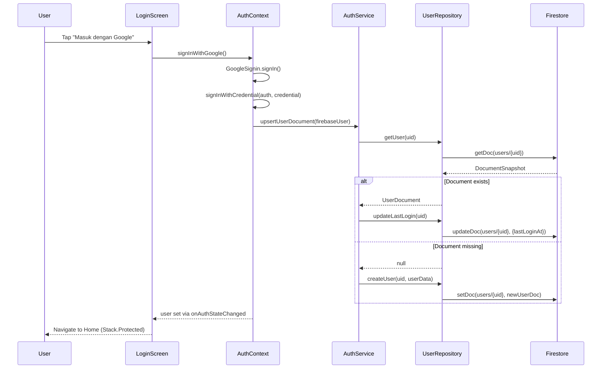
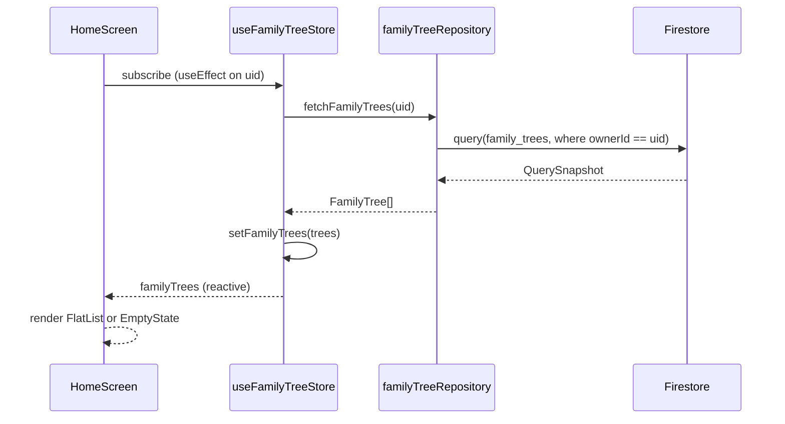
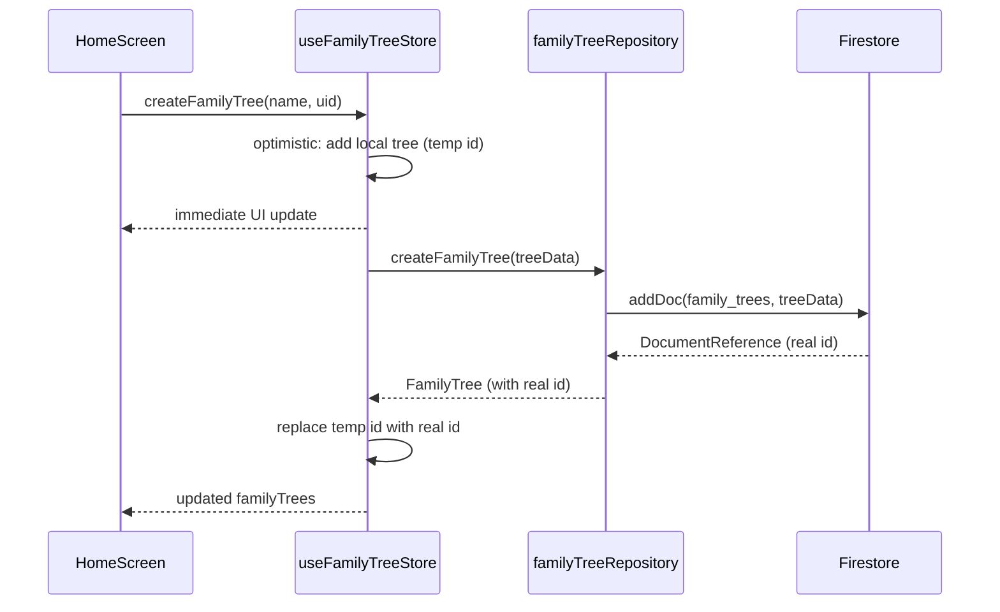
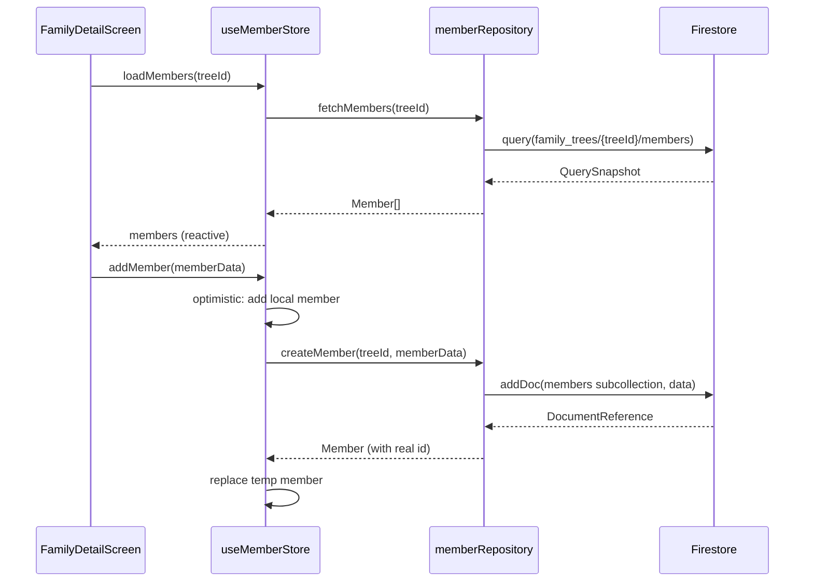

# Design Document: Firebase Firestore Integration (Step 6)

## Overview

This document covers the full backend integration for the AsalUsul mobile app — replacing local-only Zustand state with real Firebase Authentication user documents and Firestore-backed family tree data. The integration introduces a layered service architecture (Firebase services → repositories → Zustand stores → screens) that keeps all Firebase SDK calls out of UI components and positions the app for future collaboration and offline support.

The design is intentionally scoped to Step 6: authenticated single-user CRUD for users, family trees, and members. Collaboration, media upload, push notifications, and advanced permissions are explicitly out of scope.

---

## Architecture

### System Layers

```mermaid
graph TD
    subgraph UI["UI Layer (Screens)"]
        LS[login.tsx]
        HS[index.tsx — Home]
        FD[family/[id].tsx]
        MD[member/[id].tsx]
        SS[setting.tsx]
    end

    subgraph Stores["State Layer (Zustand)"]
        AS[useAuthStore]
        FTS[useFamilyTreeStore]
        MS[useMemberStore]
    end

    subgraph Repos["Repository Layer"]
        UR[userRepository]
        FTR[familyTreeRepository]
        MR[memberRepository]
    end

    subgraph Services["Firebase Service Layer"]
        AuthSvc[auth.ts — AuthService]
        FSSvc[firestore.ts — FirestoreHelpers]
        Cfg[config.ts — re-exports]
    end

    subgraph Firebase["Firebase SDK (v12)"]
        FBAuth[Firebase Auth]
        FBFS[Cloud Firestore]
    end

    subgraph Context["Auth Context (existing)"]
        AC[auth-context.tsx]
    end

    LS --> AC
    HS --> AS
    HS --> FTS
    FD --> FTS
    FD --> MS
    MD --> MS
    SS --> AC

    AC --> AuthSvc
    AS --> AuthSvc
    FTS --> FTR
    MS --> MR

    AuthSvc --> UR
    FTR --> FSSvc
    MR --> FSSvc
    UR --> FSSvc

    Cfg --> FBAuth
    Cfg --> FBFS
    AuthSvc --> Cfg
    FSSvc --> Cfg
```

### Directory Structure

```
src/
├── lib/
│   └── firebase.ts              ← existing: app + auth init (unchanged)
├── services/
│   └── firebase/
│       ├── config.ts            ← re-exports app, auth, db (Firestore instance)
│       ├── auth.ts              ← auth service: post-login user doc upsert
│       └── firestore.ts         ← generic Firestore helpers (withRetry, converters)
├── repositories/
│   ├── userRepository.ts        ← CRUD for users/{uid}
│   ├── familyTreeRepository.ts  ← CRUD for family_trees/{treeId}
│   └── memberRepository.ts      ← CRUD for family_trees/{treeId}/members/{memberId}
├── store/
│   ├── useAuthStore.ts          ← NEW: auth state (user, loading, error)
│   ├── useFamilyTreeStore.ts    ← EXTENDED: Firestore sync replaces dummy data
│   └── useMemberStore.ts        ← NEW: member state synced from Firestore
├── types/
│   ├── familyTree.ts            ← existing (unchanged)
│   └── firestore.ts             ← NEW: Firestore document types with Timestamps
└── context/
    └── auth-context.tsx         ← EXTENDED: calls AuthService.upsertUserDocument
```

---

## Sequence Diagrams

### Auth Flow: Google Sign-In → Firestore User Upsert



### Data Flow: Home Screen Load



### Create Family Tree



### Member CRUD Flow



---

## Components and Interfaces

### AuthService (`src/services/firebase/auth.ts`)

**Purpose**: Orchestrates post-authentication Firestore side effects — user document creation or update.

**Interface**:
```typescript
interface AuthService {
  /**
   * Called after successful Firebase Auth sign-in.
   * Creates user document if missing, updates lastLoginAt if present.
   * Precondition: firebaseUser is a valid authenticated Firebase User.
   * Postcondition: users/{uid} exists in Firestore with up-to-date fields.
   */
  upsertUserDocument(firebaseUser: FirebaseUser): Promise<void>
}
```

**Responsibilities**:
- Delegate to `userRepository.getUser(uid)` to check existence
- Branch: create vs. update
- Never throw to the caller — log errors internally and resolve gracefully

---

### FirestoreHelpers (`src/services/firebase/firestore.ts`)

**Purpose**: Generic utilities shared across all repositories — retry logic, error classification, Timestamp conversion.

**Interface**:
```typescript
interface FirestoreHelpers {
  withRetry<T>(operation: () => Promise<T>, options?: RetryOptions): Promise<T>
  isPermissionError(error: unknown): boolean
  isNetworkError(error: unknown): boolean
  serverTimestamp(): FieldValue
  toISOString(timestamp: Timestamp): string
}

interface RetryOptions {
  maxAttempts: number   // default: 3
  baseDelayMs: number   // default: 500
  maxDelayMs: number    // default: 8000
}
```

**Responsibilities**:
- Exponential backoff with jitter for transient Firestore errors
- Classify Firebase error codes into actionable categories
- Provide a consistent Timestamp ↔ ISO string conversion

---

### UserRepository (`src/repositories/userRepository.ts`)

**Purpose**: All Firestore reads and writes for the `users/{uid}` collection.

**Interface**:
```typescript
interface UserRepository {
  getUser(uid: string): Promise<UserDocument | null>
  createUser(uid: string, data: CreateUserInput): Promise<UserDocument>
  updateLastLogin(uid: string): Promise<void>
  updateUser(uid: string, patch: Partial<UpdateUserInput>): Promise<void>
}
```

**Responsibilities**:
- Map Firestore `DocumentSnapshot` → `UserDocument`
- Apply `serverTimestamp()` for `createdAt`, `updatedAt`, `lastLoginAt`
- Never expose raw Firestore types to callers

---

### FamilyTreeRepository (`src/repositories/familyTreeRepository.ts`)

**Purpose**: All Firestore reads and writes for the `family_trees/{treeId}` collection.

**Interface**:
```typescript
interface FamilyTreeRepository {
  fetchFamilyTrees(ownerId: string): Promise<FamilyTree[]>
  getFamilyTree(treeId: string): Promise<FamilyTree | null>
  createFamilyTree(data: CreateFamilyTreeInput): Promise<FamilyTree>
  updateFamilyTree(treeId: string, patch: Partial<UpdateFamilyTreeInput>): Promise<void>
  deleteFamilyTree(treeId: string): Promise<void>
}
```

**Responsibilities**:
- Query with `where('ownerId', '==', uid)` and `orderBy('updatedAt', 'desc')`
- Map Firestore Timestamps to ISO strings for Zustand compatibility
- Cascade delete: delete all members subcollection docs before deleting tree doc

---

### MemberRepository (`src/repositories/memberRepository.ts`)

**Purpose**: All Firestore reads and writes for the `family_trees/{treeId}/members/{memberId}` subcollection.

**Interface**:
```typescript
interface MemberRepository {
  fetchMembers(treeId: string): Promise<Member[]>
  getMember(treeId: string, memberId: string): Promise<Member | null>
  createMember(treeId: string, data: CreateMemberInput): Promise<Member>
  updateMember(treeId: string, memberId: string, patch: Partial<UpdateMemberInput>): Promise<void>
  deleteMember(treeId: string, memberId: string): Promise<void>
  batchUpdateRelationships(treeId: string, updates: RelationshipUpdate[]): Promise<void>
}
```

**Responsibilities**:
- Use Firestore batch writes for relationship symmetry updates
- Map subcollection path: `family_trees/{treeId}/members/{memberId}`
- Increment/decrement `totalMembers` on parent tree doc atomically via transaction

---

### useAuthStore (`src/store/useAuthStore.ts`)

**Purpose**: Zustand store for auth state — complements the existing `AuthContext` by providing a store-accessible auth state for non-React contexts (repositories, other stores).

**Interface**:
```typescript
interface AuthState {
  uid: string | null
  isAuthenticated: boolean
  authError: string | null
}

interface AuthActions {
  setUid(uid: string | null): void
  setAuthError(error: string | null): void
  clearAuth(): void
}
```

---

### useFamilyTreeStore (extended)

**New actions added to existing store**:
```typescript
interface FamilyTreeFirestoreActions {
  loadFamilyTrees(uid: string): Promise<void>
  createFamilyTree(name: string, uid: string): Promise<void>
  syncFamilyTree(tree: FamilyTree): void
  setLoading(loading: boolean): void
  setError(error: string | null): void
}
```

---

### useMemberStore (`src/store/useMemberStore.ts`)

**Purpose**: New dedicated Zustand store for member state, separated from family tree store for cleaner concerns.

**Interface**:
```typescript
interface MemberState {
  membersByTreeId: Record<string, Member[]>
  loadingTreeId: string | null
  memberError: string | null
}

interface MemberActions {
  loadMembers(treeId: string): Promise<void>
  addMember(treeId: string, data: Omit<Member, 'id' | 'createdAt'>): Promise<void>
  updateMember(treeId: string, memberId: string, patch: Partial<Member>): Promise<void>
  deleteMember(treeId: string, memberId: string): Promise<void>
  clearMembers(treeId: string): void
}
```

---

## Data Models

### Firestore Document Types (`src/types/firestore.ts`)

```typescript
import { Timestamp, FieldValue } from 'firebase/firestore'

/** Firestore document shape for users/{uid} */
export interface UserDocument {
  id: string
  name: string
  email: string
  photoUrl: string
  provider: 'google'
  createdAt: Timestamp
  updatedAt: Timestamp
  lastLoginAt: Timestamp
}

/** Input for creating a new user document */
export interface CreateUserInput {
  name: string
  email: string
  photoUrl: string
  provider: 'google'
}

/** Firestore document shape for family_trees/{treeId} */
export interface FamilyTreeDocument {
  id: string
  name: string
  description: string | null
  ownerId: string
  totalMembers: number
  /**
   * Array of Firebase Auth UIDs the owner has shared this tree with.
   * Empty array by default. Reserved for future read-only sharing.
   */
  shareWith: string[]
  createdAt: Timestamp
  updatedAt: Timestamp
}

/** Input for creating a new family tree */
export interface CreateFamilyTreeInput {
  name: string
  description: string | null
  ownerId: string
  /** Defaults to [] on creation */
  shareWith?: string[]
}

/** Partial update input for family trees */
export interface UpdateFamilyTreeInput {
  name: string
  description: string | null
  shareWith: string[]
}

/** Firestore document shape for family_trees/{treeId}/members/{memberId} */
export interface MemberDocument {
  id: string
  familyTreeId: string
  fullName: string
  gender: 'male' | 'female'
  role: string
  birthDate: string | null
  fatherId: string | null
  motherId: string | null
  spouseIds: string[]
  childrenIds: string[]
  createdAt: Timestamp
  updatedAt: Timestamp
}

/** Input for creating a new member */
export interface CreateMemberInput {
  familyTreeId: string
  fullName: string
  gender: 'male' | 'female'
  role: string
  birthDate: string | null
  fatherId: string | null
  motherId: string | null
  spouseIds: string[]
  childrenIds: string[]
}

/** Relationship batch update descriptor */
export interface RelationshipUpdate {
  memberId: string
  patch: Partial<Pick<MemberDocument, 'spouseIds' | 'childrenIds' | 'fatherId' | 'motherId'>>
}
```

**Validation Rules**:
- `UserDocument.email` must be non-empty string
- `FamilyTreeDocument.name` must be non-empty after trim, max 100 chars
- `FamilyTreeDocument.ownerId` must equal the authenticated `uid`
- `FamilyTreeDocument.shareWith` must be an array of strings (empty array is valid); each entry should be a non-empty string uid
- `MemberDocument.fullName` must be non-empty after trim
- `MemberDocument.gender` must be `'male'` or `'female'`
- `MemberDocument.spouseIds` and `childrenIds` must not contain the member's own `id`

---

## Algorithmic Pseudocode

### Algorithm: upsertUserDocument

```typescript
async function upsertUserDocument(firebaseUser: FirebaseUser): Promise<void>
```

**Preconditions:**
- `firebaseUser.uid` is a non-empty string
- `firebaseUser.email` is non-null (Google accounts always have email)
- Firestore is initialized and reachable

**Postconditions:**
- `users/{uid}` document exists in Firestore
- If newly created: all fields populated, `createdAt === updatedAt === lastLoginAt`
- If updated: only `lastLoginAt` and `updatedAt` changed
- No exception propagates to caller (errors are logged)

**Algorithm:**
```typescript
// STEP 1: Attempt to read existing document
const existing = await userRepository.getUser(firebaseUser.uid)

// STEP 2: Branch on existence
if (existing === null) {
  // CREATE path
  await userRepository.createUser(firebaseUser.uid, {
    name: firebaseUser.displayName ?? '',
    email: firebaseUser.email!,
    photoUrl: firebaseUser.photoURL ?? '',
    provider: 'google',
  })
} else {
  // UPDATE path — only touch lastLoginAt
  await userRepository.updateLastLogin(firebaseUser.uid)
}
// POSTCONDITION: users/{uid} exists with correct timestamps
```

---

### Algorithm: loadFamilyTrees (with optimistic empty state)

```typescript
async function loadFamilyTrees(uid: string): Promise<void>
```

**Preconditions:**
- `uid` is non-empty string of authenticated user
- `familyTreeRepository` is available

**Postconditions:**
- `useFamilyTreeStore.familyTrees` contains all trees where `ownerId === uid`
- `loading` is `false`
- On error: `error` is set, `familyTrees` retains previous value

**Algorithm:**
```typescript
// STEP 1: Set loading state
set({ loading: true, error: null })

try {
  // STEP 2: Fetch from Firestore
  const trees = await familyTreeRepository.fetchFamilyTrees(uid)

  // STEP 3: Replace store state (clear dummy data)
  set({ familyTrees: trees, loading: false })

} catch (error) {
  // STEP 4: Preserve existing data, surface error
  const message = classifyError(error)
  set({ loading: false, error: message })
}
// POSTCONDITION: loading === false, familyTrees reflects Firestore state or error is set
```

---

### Algorithm: createFamilyTree (optimistic update pattern)

```typescript
async function createFamilyTree(name: string, uid: string): Promise<void>
```

**Preconditions:**
- `name.trim().length > 0`
- `uid` matches authenticated user
- User is online (optimistic update proceeds regardless)

**Postconditions:**
- On success: `familyTrees` contains new tree with real Firestore id
- On failure: optimistic tree is removed, `error` is set

**Loop Invariants:** N/A (no loops)

**Algorithm:**
```typescript
// STEP 1: Generate temp id for optimistic update
const tempId = `temp_${Date.now()}`
const now = new Date().toISOString()
const optimisticTree: FamilyTree = {
  id: tempId, name: name.trim(), description: null,
  coverImage: null, ownerId: uid, totalMembers: 0,
  shareWith: [],
  createdAt: now, updatedAt: now,
}

// STEP 2: Optimistic insert — immediate UI feedback
set(state => ({ familyTrees: [optimisticTree, ...state.familyTrees] }))

try {
  // STEP 3: Persist to Firestore
  const realTree = await familyTreeRepository.createFamilyTree({
    name: name.trim(), description: null, ownerId: uid,
  })

  // STEP 4: Replace temp entry with real Firestore document
  set(state => ({
    familyTrees: state.familyTrees.map(t => t.id === tempId ? realTree : t)
  }))

} catch (error) {
  // STEP 5: Rollback optimistic update
  set(state => ({
    familyTrees: state.familyTrees.filter(t => t.id !== tempId),
    error: classifyError(error),
  }))
}
```

---

### Algorithm: withRetry (exponential backoff)

```typescript
async function withRetry<T>(
  operation: () => Promise<T>,
  options: RetryOptions = { maxAttempts: 3, baseDelayMs: 500, maxDelayMs: 8000 }
): Promise<T>
```

**Preconditions:**
- `operation` is a callable that returns a Promise
- `options.maxAttempts >= 1`

**Postconditions:**
- Returns resolved value of `operation` on success
- Throws last error after `maxAttempts` exhausted
- Only retries on transient errors (network, unavailable); never retries permission errors

**Loop Invariant:** `attempt <= maxAttempts` and all previous attempts failed with retryable errors

**Algorithm:**
```typescript
let attempt = 0

while (attempt < options.maxAttempts) {
  // INVARIANT: attempt < maxAttempts, all previous attempts failed transiently
  try {
    return await operation()
  } catch (error) {
    attempt++

    // Never retry permission or auth errors
    if (isPermissionError(error) || isAuthError(error)) {
      throw error
    }

    // Exhausted all attempts
    if (attempt >= options.maxAttempts) {
      throw error
    }

    // Exponential backoff with jitter
    const delay = Math.min(
      options.baseDelayMs * Math.pow(2, attempt - 1) + Math.random() * 100,
      options.maxDelayMs
    )
    await sleep(delay)
  }
}
// POSTCONDITION: either returned successfully or threw after maxAttempts
```

---

### Algorithm: deleteFamilyTree (cascade delete via batch)

```typescript
async function deleteFamilyTree(treeId: string): Promise<void>
```

**Preconditions:**
- `treeId` is a valid Firestore document id
- Authenticated user is the `ownerId` of the tree (enforced by security rules)

**Postconditions:**
- `family_trees/{treeId}` document deleted
- All `family_trees/{treeId}/members/*` documents deleted
- `useFamilyTreeStore.familyTrees` no longer contains the tree
- `useMemberStore.membersByTreeId[treeId]` cleared

**Algorithm:**
```typescript
// STEP 1: Optimistic removal from store
set(state => ({
  familyTrees: state.familyTrees.filter(t => t.id !== treeId)
}))
memberStore.clearMembers(treeId)

try {
  // STEP 2: Fetch all member doc refs (for batch delete)
  const memberRefs = await memberRepository.getAllMemberRefs(treeId)

  // STEP 3: Batch delete members + tree in one Firestore commit
  const batch = writeBatch(db)
  for (const ref of memberRefs) {
    // INVARIANT: all refs processed so far are queued for deletion
    batch.delete(ref)
  }
  batch.delete(doc(db, 'family_trees', treeId))
  await batch.commit()

} catch (error) {
  // STEP 4: Rollback — reload from Firestore
  await loadFamilyTrees(uid)
  throw error
}
```

---

## Key Functions with Formal Specifications

### `userRepository.createUser`

```typescript
async function createUser(uid: string, data: CreateUserInput): Promise<UserDocument>
```

**Preconditions:**
- `uid` is non-empty string
- `data.email` is non-empty string
- `data.provider === 'google'`
- No document exists at `users/{uid}` (caller must check first)

**Postconditions:**
- Document created at `users/{uid}` with all fields
- `createdAt === updatedAt === lastLoginAt` (all server timestamps)
- Returns `UserDocument` with resolved Timestamps

---

### `familyTreeRepository.fetchFamilyTrees`

```typescript
async function fetchFamilyTrees(ownerId: string): Promise<FamilyTree[]>
```

**Preconditions:**
- `ownerId` is non-empty string matching authenticated uid

**Postconditions:**
- Returns array (possibly empty) of `FamilyTree` objects
- All returned trees satisfy `tree.ownerId === ownerId`
- Results ordered by `updatedAt` descending
- Timestamps converted to ISO strings

---

### `memberRepository.batchUpdateRelationships`

```typescript
async function batchUpdateRelationships(
  treeId: string,
  updates: RelationshipUpdate[]
): Promise<void>
```

**Preconditions:**
- `treeId` is valid and authenticated user owns the tree
- `updates` is non-empty array
- Each `update.memberId` exists in the subcollection

**Postconditions:**
- All updates committed atomically (all succeed or all fail)
- Relationship symmetry maintained: if A lists B as spouse, B lists A as spouse

---

### `auth-context.tsx` — extended `signInWithGoogle`

```typescript
// After successful Firebase credential exchange, add:
await authService.upsertUserDocument(firebaseUser)
```

**Preconditions:**
- `firebaseUser` is the result of `signInWithCredential` — guaranteed non-null
- `authService` is initialized

**Postconditions:**
- `users/{uid}` exists in Firestore before `onAuthStateChanged` resolves to screens
- Failure in `upsertUserDocument` does NOT block navigation (logged, non-fatal)

---

## Example Usage

### Initializing Firestore in config.ts

```typescript
// src/services/firebase/config.ts
import { getApp } from 'firebase/app'
import { getFirestore } from 'firebase/firestore'
import { auth } from '@/lib/firebase'

export { auth }
export const db = getFirestore(getApp())
```

### UserRepository — getUser

```typescript
// src/repositories/userRepository.ts
import { doc, getDoc } from 'firebase/firestore'
import { db } from '@/services/firebase/config'
import type { UserDocument } from '@/types/firestore'

export async function getUser(uid: string): Promise<UserDocument | null> {
  const ref = doc(db, 'users', uid)
  const snap = await getDoc(ref)
  if (!snap.exists()) return null
  return { id: snap.id, ...snap.data() } as UserDocument
}
```

### FamilyTreeRepository — fetchFamilyTrees

```typescript
// src/repositories/familyTreeRepository.ts
import { collection, query, where, orderBy, getDocs } from 'firebase/firestore'
import { db } from '@/services/firebase/config'
import type { FamilyTree } from '@/types/familyTree'
import type { FamilyTreeDocument } from '@/types/firestore'

export async function fetchFamilyTrees(ownerId: string): Promise<FamilyTree[]> {
  const q = query(
    collection(db, 'family_trees'),
    where('ownerId', '==', ownerId),
    orderBy('updatedAt', 'desc')
  )
  const snap = await getDocs(q)
  return snap.docs.map(d => mapDocToFamilyTree(d.id, d.data() as FamilyTreeDocument))
}

function mapDocToFamilyTree(id: string, data: FamilyTreeDocument): FamilyTree {
  return {
    id,
    name: data.name,
    description: data.description,
    coverImage: null,
    ownerId: data.ownerId,
    totalMembers: data.totalMembers,
    shareWith: data.shareWith ?? [],
    createdAt: data.createdAt.toDate().toISOString(),
    updatedAt: data.updatedAt.toDate().toISOString(),
  }
}
```

### useFamilyTreeStore — loadFamilyTrees action

```typescript
// src/store/useFamilyTreeStore.ts (extended)
loadFamilyTrees: async (uid: string) => {
  set({ loading: true, error: null })
  try {
    const trees = await familyTreeRepository.fetchFamilyTrees(uid)
    set({ familyTrees: trees, loading: false })
  } catch (err) {
    set({ loading: false, error: classifyError(err) })
  }
}
```

### HomeScreen — wiring uid to store load

```typescript
// src/app/(tabs)/index.tsx (extended)
const { user } = useAuth()
const loadFamilyTrees = useFamilyTreeStore(s => s.loadFamilyTrees)

useEffect(() => {
  if (user?.uid) {
    loadFamilyTrees(user.uid)
  }
}, [user?.uid])
```

### withRetry usage in repository

```typescript
// Inside familyTreeRepository.createFamilyTree
const docRef = await withRetry(() =>
  addDoc(collection(db, 'family_trees'), {
    ...data,
    totalMembers: 0,
    createdAt: serverTimestamp(),
    updatedAt: serverTimestamp(),
  })
)
```

---

## Correctness Properties

### Property 1: User Document Invariant
For every authenticated session, `users/{uid}` must exist in Firestore before the home screen renders.

**Validates: Requirements 1.1**

```typescript
// ∀ user ∈ AuthenticatedUsers:
//   upsertUserDocument(user) completes BEFORE onAuthStateChanged resolves
assert(await userRepository.getUser(uid) !== null)
```

### Property 2: Ownership Invariant
Every family tree returned by `fetchFamilyTrees(uid)` satisfies `tree.ownerId === uid`.

**Validates: Requirements 2.1**

```typescript
// ∀ tree ∈ fetchFamilyTrees(uid): tree.ownerId === uid
const trees = await fetchFamilyTrees(uid)
assert(trees.every(t => t.ownerId === uid))
```

### Property 3: Optimistic Rollback Consistency
If `createFamilyTree` Firestore write fails, the optimistic entry is removed and the store returns to its pre-call state.

**Validates: Requirements 3.1**

```typescript
// pre: familyTrees.length === n
// post (on error): familyTrees.length === n
// post (on success): familyTrees.length === n + 1
```

### Property 4: Relationship Symmetry
After any member creation or update, if member A lists member B as a spouse, then member B lists member A as a spouse.

**Validates: Requirements 4.1**

```typescript
// ∀ memberA, memberB ∈ members(treeId):
//   memberA.spouseIds.includes(memberB.id) ⟺ memberB.spouseIds.includes(memberA.id)
```

### Property 5: totalMembers Consistency
`FamilyTree.totalMembers` always equals the count of member documents in its subcollection.

**Validates: Requirements 4.2**

```typescript
// ∀ tree ∈ family_trees:
//   tree.totalMembers === count(family_trees/{tree.id}/members)
```

### Property 6: Retry Non-Amplification
`withRetry` never retries permission errors — retrying a `permission-denied` error would always fail and waste quota.

**Validates: Requirements 5.1**

```typescript
// ∀ error where isPermissionError(error) === true:
//   withRetry throws immediately without retry
```

### Property 7: Cascade Delete Completeness
After `deleteFamilyTree(treeId)`, no orphaned member documents remain in Firestore.

**Validates: Requirements 3.2**

```typescript
// post: count(family_trees/{treeId}/members) === 0
// post: exists(family_trees/{treeId}) === false
```

---

## Error Handling

### Error Scenario 1: Firestore Permission Denied

**Condition**: Security rules reject a read/write (e.g., expired token, wrong uid)
**Response**: `isPermissionError(error)` returns `true`; `withRetry` does NOT retry; store sets `error = 'Akses ditolak. Silakan masuk kembali.'`
**Recovery**: `AuthContext.signOut()` is called; user redirected to login screen

### Error Scenario 2: Network Unavailable

**Condition**: Device offline or Firestore unreachable
**Response**: `isNetworkError(error)` returns `true`; `withRetry` retries up to 3× with exponential backoff; after exhaustion, store sets `error = 'Tidak ada koneksi internet.'`
**Recovery**: UI shows offline banner with "Coba Lagi" button; Firestore offline cache serves stale reads

### Error Scenario 3: User Document Missing After Login

**Condition**: `upsertUserDocument` fails silently (network error during sign-in)
**Response**: Error is logged; sign-in still completes; next sign-in attempt will retry upsert
**Recovery**: `onAuthStateChanged` fires again on next app open; `upsertUserDocument` is called again

### Error Scenario 4: Optimistic Update Failure

**Condition**: `createFamilyTree` or `addMember` Firestore write fails after optimistic insert
**Response**: Optimistic entry removed from store; `error` state set with user-facing message
**Recovery**: UI shows toast/snackbar with error; user can retry the action

### Error Scenario 5: Invalid Auth Session

**Condition**: Firebase token expired mid-session
**Response**: Firestore returns `permission-denied`; `isPermissionError` catches it
**Recovery**: Force sign-out via `AuthContext.signOut()`; navigate to login

---

## Testing Strategy

### Unit Testing Approach

Each repository function is tested in isolation with Firestore mocked via `jest.mock('firebase/firestore')`. Each Zustand store action is tested with the repository mocked.

Key unit test cases:
- `upsertUserDocument`: create path, update path, error path (non-fatal)
- `fetchFamilyTrees`: empty result, multiple trees, ordering
- `createFamilyTree`: optimistic insert, success replace, failure rollback
- `withRetry`: success on first attempt, success on retry, exhaustion, permission error no-retry
- `deleteFamilyTree`: cascade delete, rollback on failure

### Property-Based Testing Approach

**Property Test Library**: `fast-check` (already installed in devDependencies)

```typescript
// Property: fetchFamilyTrees always returns trees owned by uid
fc.assert(
  fc.asyncProperty(fc.string(), async (uid) => {
    const trees = await fetchFamilyTrees(uid)
    return trees.every(t => t.ownerId === uid)
  })
)

// Property: withRetry never retries permission errors
fc.assert(
  fc.asyncProperty(fc.record({ code: fc.constant('permission-denied') }), async (error) => {
    let callCount = 0
    const op = () => { callCount++; return Promise.reject(error) }
    await withRetry(op).catch(() => {})
    return callCount === 1
  })
)

// Property: optimistic rollback restores original length
fc.assert(
  fc.asyncProperty(fc.array(fc.string()), async (names) => {
    // seed store with n trees, fail createFamilyTree, assert length unchanged
  })
)
```

### Integration Testing Approach

Integration tests use the Firebase Local Emulator Suite (`firebase emulators:start`). Tests cover:
- Full auth → upsert → fetch cycle
- Security rules enforcement (cross-uid access rejected)
- Cascade delete completeness
- Batch relationship update atomicity

---

## Performance Considerations

- **Query efficiency**: `fetchFamilyTrees` uses a compound index on `(ownerId, updatedAt)` — must be created in Firestore console or `firestore.indexes.json`
- **Pagination**: Not required for Step 6 (single user, expected < 50 trees), but `familyTreeRepository` should accept an optional `limit` parameter for future use
- **Member subcollection**: Loaded on-demand per tree (not eagerly on home screen) — `useMemberStore.loadMembers(treeId)` called only when `FamilyDetailScreen` mounts
- **Optimistic updates**: Eliminate perceived latency for create operations; rollback is rare on good connections
- **Firestore offline cache**: Enabled by default in Firebase SDK v12 for React Native — stale reads are served instantly while network syncs in background

---

## Security Considerations

- **Security rules** enforce server-side ownership checks — client-side uid checks are UX only, not security boundaries
- **No uid in client-generated ids**: Firestore `addDoc` generates ids server-side; never use `uid` as part of a document id
- **Environment variables**: All Firebase config values are in `.env` via `EXPO_PUBLIC_*` — never hardcoded
- **Token refresh**: Firebase SDK handles token refresh automatically; `permission-denied` errors trigger re-auth flow
- **Firestore rules** for members use `get()` to verify tree ownership — this counts as an extra read per member write; acceptable for Step 6 scale

---

## Offline Architecture Preparation

The design is structured to support offline-first in a future step:

- **Firestore offline persistence**: Already enabled by default in Firebase SDK v12 for React Native. No additional setup needed.
- **Optimistic updates**: Already designed into `createFamilyTree` and `addMember` — UI updates before network confirmation.
- **Sync queue concept**: `useFamilyTreeStore` and `useMemberStore` will expose a `pendingOps: PendingOperation[]` array in a future step. Each failed write is queued and retried when connectivity is restored.
- **Conflict resolution**: For Step 6 (single user, no collaboration), last-write-wins via `updatedAt` timestamp is sufficient.
- **Offline error state**: `isNetworkError` classification already distinguishes offline from other errors, enabling a dedicated offline UI banner.

---

## Dependencies

| Dependency | Version | Purpose |
|---|---|---|
| `firebase` | `^12.13.0` | Auth + Firestore SDK |
| `@react-native-async-storage/async-storage` | `2.2.0` | Auth persistence (existing) |
| `@react-native-google-signin/google-signin` | `^16.1.2` | Google Sign-In (existing) |
| `zustand` | `^5.0.13` | State management (existing) |
| `fast-check` | `^4.8.0` | Property-based testing (existing) |

No new runtime dependencies are required. All Firebase Firestore functionality is included in the existing `firebase` package.

**Firestore Index Required** (add to `firestore.indexes.json`):
```json
{
  "indexes": [
    {
      "collectionGroup": "family_trees",
      "queryScope": "COLLECTION",
      "fields": [
        { "fieldPath": "ownerId", "order": "ASCENDING" },
        { "fieldPath": "updatedAt", "order": "DESCENDING" }
      ]
    }
  ]
}
```
